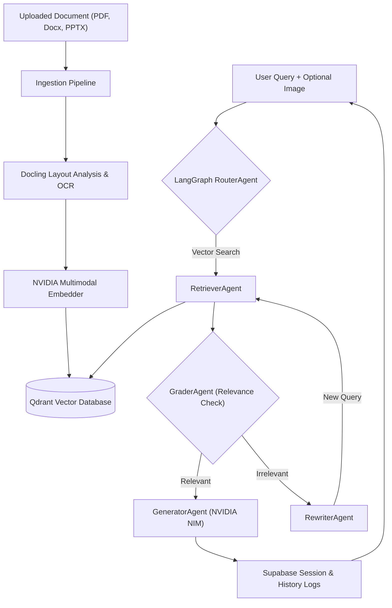

# 🚀 Lumina RAG: Multimodal Agentic Enterprise Search

[](https://www.python.org/)
[](https://github.com/langchain-ai/langgraph)
[](https://qdrant.tech/)
[](https://build.nvidia.com/)
[](https://supabase.com/)
[](#)

<p align="center">
  
  <br>
  <em>Holographic system flow of the Multimodal Corrective RAG (CRAG) pipeline</em>
</p>

Lumina RAG is a state-of-the-art, high-performance Multimodal Retrieval-Augmented Generation (RAG) platform. Powered by **LangGraph**, **Qdrant Hybrid Vector Store**, **Supabase**, and **NVIDIA NIM Cloud Endpoints**, Lumina builds a unified brain for your enterprise documents, policy papers, schemas, audio clips, and video resources.

---

## 🏗️ System Architecture & Processing Pipeline

Lumina separates ingestion, database schemas, and agentic query graphs:



---

## 🚀 Key Features

* **Multimodal Ingestion Pipeline**: Ingests, parses, and indexes PDF papers, docx, audio files (transcripts), and videos (captions + frame visual data).
* **Corrective RAG (CRAG) Workflow**: Implements an agentic routing pipeline (Router ➔ Retriever ➔ Grader ➔ Rewriter ➔ Generator) via LangGraph to prevent hallucinations and assure relevant context retrieval.
* **FastMCP Server Integration**: Exposes document indexing and hybrid vector search as standard Model Context Protocol (MCP) tools via an SSE channel mounted inside FastAPI.
* **Inline Query Editing**: Hover over any user message to edit and resubmit it. Lumina automatically truncates the conversation history at that point and streams a fresh response.
* **Persistent Session Memory**: Sessions are synchronized with Supabase database tables and preserved in `localStorage`, maintaining complete chat history across page refreshes.
* **Transparent Image Processing**: Frontend downscales and compresses uploaded screenshots and schemas (under 100KB) and preserves transparent PNG lines against a solid white background, resolving black-square conversion issues.
* **Dynamic Status Header**: The UI dynamically updates status indicators ("Lumina HR Intelligence Online", etc.) in response to target department changes.
* **Generation Abort Control**: Pulsating red stop button instantly aborts active server streaming connections using `AbortSignal` HTTP controllers.

---

## 📁 Project Structure

```text
Chatbot/
├── backend/
│   ├── app/
│   │   ├── agents/            # Intelligent agents (Router, Grader, Rewriter, Generator)
│   │   ├── graph/             # LangGraph state machine flow (crag_graph.py)
│   │   ├── ingestion/         # Parsers & image extractors (PDF, Audio, Video pipelines)
│   │   ├── retrieval/         # Qdrant Hybrid vector store connectors
│   │   ├── services/          # Client API configurations (NVIDIA NIM, Supabase REST)
│   │   ├── utils.py           # UUID generator and basic utilities
│   │   ├── main.py            # FastAPI gateway, session APIs, and MCP SSE server mount
│   │   └── mcp_server.py      # FastMCP tool registrations (list_docs, query_knowledge_base)
│   ├── .env                   # Private keys (NVIDIA Key, Qdrant Endpoint, Supabase secrets)
│   ├── requirements.txt       # Python backend dependencies
│   └── supabase_schema.sql    # Database schema migrations for sessions, messages, and documents
├── frontend/
│   ├── app/                   # Next.js React codebase, stylesheets, global page templates
│   ├── lib/                   # API client integrations, abort controllers, type signatures
│   ├── package.json           # Node project dependencies
│   └── postcss/tailwind       # Design configuration utility parameters
├── prompts/
│   └── image_prompt_Lumina.md # ChatGPT design prompts
└── README.md                  # Overall project documentation and guides
```

---

## 🛠️ Setup & Execution

### 1. Backend API Server Setup
Make sure Python 3.10+ is installed on your machine.
1. Navigate to the backend directory:
   ```bash
   cd backend
   ```
2. Install Python dependencies:
   ```bash
   pip install -r requirements.txt
   ```
3. Configure the `.env` file containing database connections and API keys:
   ```env
   NVIDIA_API_KEY="nvapi-..."
   QDRANT_URL="https://..."
   QDRANT_API_KEY="ey..."
   SUPABASE_URL="https://..."
   SUPABASE_SERVICE_KEY="sb_secret_..."
   ```
4. Start the FastAPI server:
   ```bash
   python -m uvicorn app.main:app --host 127.0.0.1 --port 8000
   ```

### 2. Frontend Interface Setup
Make sure Node.js (v18+) is installed.
1. Navigate to the frontend directory:
   ```bash
   cd ../frontend
   ```
2. Install Node modules:
   ```bash
   npm install
   ```
3. Run the Next.js development server:
   ```bash
   npm run dev
   ```
4. Access the web interface at [http://localhost:3000](http://localhost:3000).

---

## 🛡️ Corporate Confidentiality Notice
This repository is an anonymized, public proof-of-concept (`[Public POC]`) demonstrating the semantic matching and memory pipeline architectures. It does not contain proprietary data or internal intellectual property from Bosch or ZF Rane.
