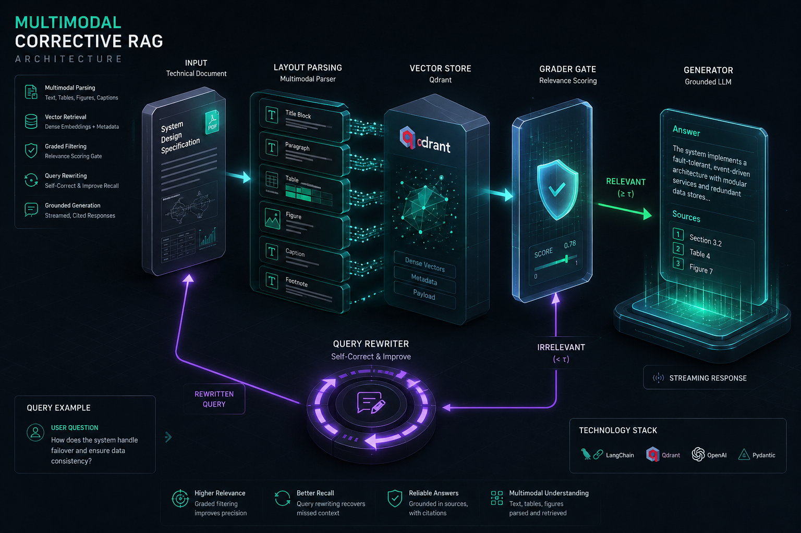
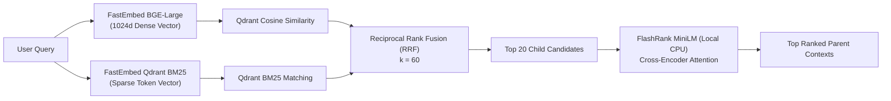
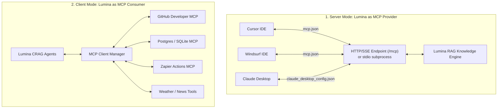

# Lumina — Enterprise Multimodal Adaptive CRAG & MCP Hub

<div align="center">



[](https://fastapi.tiangolo.com)
[](https://nextjs.org)
[](https://react.dev)
[](https://www.typescriptlang.org)
[](https://tailwindcss.com)
[](https://langchain-ai.github.io/langgraph/)
[](https://qdrant.tech)
[](https://qdrant.github.io/fastembed/)
[](https://github.com/PrithivirajDamodaran/FlashRank)
[](https://modelcontextprotocol.io)
[](LICENSE)

**A 100% free-tier, enterprise-grade Multimodal Corrective Retrieval-Augmented Generation (CRAG) system and Model Context Protocol (MCP) Hub.**  
*Upload documents, audio, and images; watch 5 autonomous agents self-correct and reason in real-time; and expose or connect external MCP tools with zero GPU requirements and zero proprietary SaaS lock-in.*

</div>

---

## 📑 Table of Contents

- [Executive Overview](#-executive-overview)
- [System Architecture](#-system-architecture)
- [Core Architectural Innovations](#-core-architectural-innovations)
  - [1. Two-Tier Hierarchical Parent-Child Chunking](#1-two-tier-hierarchical-parent-child-chunking)
  - [2. Anthropic-Style Contextual Document Headers](#2-anthropic-style-contextual-document-headers)
  - [3. Local-First Hybrid Retrieval & Cross-Encoder Reranking](#3-local-first-hybrid-retrieval--cross-encoder-reranking)
  - [4. Corrective RAG (CRAG) 5-Agent Cyclic State Graph](#4-corrective-rag-crag-5-agent-cyclic-state-graph)
  - [5. Model Context Protocol (MCP) Hub Architecture](#5-model-context-protocol-mcp-hub-architecture)
  - [6. Multi-Tenant Session Isolation & Privacy](#6-multi-tenant-session-isolation--privacy)
  - [7. Dual-Layer Persistence Engine](#7-dual-layer-persistence-engine)
- [Out-of-the-Box Thinking Area & Observability](#-out-of-the-box-thinking-area--observability)
- [Multimodal Ingestion Pipeline](#-multimodal-ingestion-pipeline)
- [Model Context Protocol (MCP) Integration Guide](#-model-context-protocol-mcp-integration-guide)
  - [Connecting Cursor / Windsurf](#1-connecting-cursor--windsurf)
  - [Connecting Claude Desktop](#2-connecting-claude-desktop)
  - [Connecting External Tools into Lumina](#3-connecting-external-tools-into-lumina)
- [Technology Stack Matrix](#-technology-stack-matrix)
- [Step-by-Step Installation & Quick Start](#-step-by-step-installation--quick-start)
  - [Prerequisites](#prerequisites)
  - [Backend Setup](#backend-setup)
  - [Frontend Setup](#frontend-setup)
- [Environment Variables Reference](#-environment-variables-reference)
- [REST API & Server-Sent Events (SSE) Reference](#-rest-api--server-sent-events-sse-reference)
- [Directory Structure](#-directory-structure)
- [Automated Testing & Verification](#-automated-testing--verification)
- [Production Deployment Guide](#-production-deployment-guide)
- [License & Acknowledgments](#-license--acknowledgments)

---

## 💡 Executive Overview

Traditional RAG implementations suffer from fundamental bottlenecks:
1. **The Precision vs. Context Tradeoff:** Small chunks optimize vector search precision but starve LLMs of surrounding context; large chunks preserve context but dilute vector embeddings with noise.
2. **Passive Retrieval Hallucination:** Standard RAG naively feeds whatever context the vector database returns into the generator, even when retrieved documents are irrelevant, outdated, or incomplete.
3. **High Infrastructure Costs:** Commercial RAG stacks depend on proprietary vector databases, heavy GPU clusters, and costly third-party embedding APIs.
4. **Opaque Black-Box Execution:** Users receive answers with no visibility into how retrieval decisions were made, why certain passages were selected, or how queries were restructured.

**Lumina eliminates these barriers entirely:**
- **Zero Recurring Cloud Cost:** Built from the ground up to operate completely on generous free-tier cloud resources and local CPU-optimized ONNX runtimes.
- **Autonomous Self-Correction (CRAG):** Features a compiled LangGraph state machine where a **Grader Agent** actively inspects evidence relevance, triggering a **Rewriter Agent** (HyDE, Step-Back, Sub-Query Decomposition) whenever initial retrieval falls short.
- **Hierarchical Parent-Child Resolution:** Indexes 128-token child passages for surgical vector/BM25 matching, then seamlessly resolves surviving matches to full 1024-token parent blocks for generation.
- **Universal Model Context Protocol (MCP) Hub:** Operates as both an MCP server (allowing Cursor and Claude Desktop to query your RAG archive) and an MCP client (enabling Lumina agents to invoke external tools like GitHub, SQL databases, and Zapier).
- **Glass-Box Observability:** Streams agent transitions, thinking logs, and generation tokens in real-time to a cognitive **Thinking Area** with Timeline, Matrix, and Audit Log views.

---

## 🏗️ System Architecture

```mermaid
flowchart TD
    subgraph ClientLayer ["🖥️ Client Layer (Next.js 14 / React 19)"]
        UI["Modern Workspace UI<br/>(Light / Dark Mode)"]
        ThinkingArea["🧠 Cognitive Thinking Area<br/>(Timeline • Matrix • Log)"]
        ModelSelector["⚡ Dynamic Model Selector<br/>(Gemini • Nemotron • Llama)"]
        MCPModal["🔌 MCP Hub Control Center<br/>(Server & Client Config)"]
    end

    subgraph SecurityLayer ["🛡️ Security & Boundary Middleware"]
        SessionMiddleware["SessionIsolationMiddleware<br/>(Enforces X-Session-ID UUID v4)"]
        SafetyGuard["SafetyGuard<br/>(Content Policy & Blocklist Filter)"]
    end

    subgraph IngestionLayer ["📥 Multimodal Ingestion Pipeline"]
        DocParser["Adaptive Document Parser<br/>(PDF, DOCX, PPTX, CSV, TXT, MD)"]
        TableExtractor["Docling Table & Chart Parser"]
        AudioTranscriber["Groq Whisper Large v3 STT"]
        ParentChild["Hierarchical Parent-Child Chunker<br/>(Parent: 1024 tok | Child: 128 tok)"]
        ContextHeaders["Anthropic Contextual Header Generator<br/>(Gemini 2.0 Flash)"]
        LocalEmbedder["Local FastEmbed Engine (CPU)<br/>(BGE-Large-EN 1024d + BM25)"]
    end

    subgraph CRAGCore ["🤖 Adaptive CRAG State Graph (LangGraph)"]
        Router["🧭 Router Agent<br/>(Intent & Filter Classifier)"]
        Retriever["🔍 Retriever Agent<br/>(Hybrid RRF Search & Parent Resolver)"]
        Grader["⚖️ Grader Agent<br/>(Relevance Scoring 0.0 - 1.0)"]
        Rewriter["🔄 Rewriter Agent<br/>(HyDE • Step-Back • Decompose)"]
        Generator["✍️ Generator Agent<br/>(Grounded Synthesis & Citation Anchoring)"]
    end

    subgraph StorageLayer ["💾 Hybrid Storage & Vector Layer"]
        Qdrant[("🔴 Qdrant Cloud / Local<br/>(Dense Vectors + BM25 Sparse Payload)")]
        Reranker["⚡ FlashRank MiniLM Cross-Encoder<br/>(Local CPU Reranking <30ms)"]
        Supabase[("🗄️ Supabase PostgreSQL<br/>(Document Registry & Chat History)")]
        LocalJSON[("📁 Local Persistence Fallback<br/>(.local_documents.json & .local_mcp.json)")]
    end

    subgraph MCPHub ["🌐 Model Context Protocol (MCP)"]
        MCPServer["Lumina MCP Server<br/>(query_knowledge_base, list_documents)"]
        MCPClient["Lumina MCP Client<br/>(GitHub, Postgres, Zapier, Weather Tools)"]
    end

    %% Client to Ingestion & Query
    UI -->|Upload Files| SessionMiddleware --> DocParser
    DocParser --> TableExtractor --> ParentChild --> ContextHeaders --> LocalEmbedder --> Qdrant
    DocParser --> Supabase
    Supabase -.->|Offline Fallback| LocalJSON

    UI -->|Submit Prompt + Attachment| SessionMiddleware --> SafetyGuard --> Router
    Router -->|Direct Chat / Greeting| Generator
    Router -->|Knowledge Search Required| Retriever

    %% CRAG Loop
    Retriever <-->|Hybrid Search (only_children=True)| Qdrant
    Retriever -->|Top-20 Candidates| Reranker
    Reranker -->|Top Filtered Children| Retriever
    Retriever -->|Resolve Parent IDs| Qdrant
    Retriever -->|Parent Contexts (1024 tok)| Grader

    Grader -->|Context Sufficient (score >= 0.7)| Generator
    Grader -->|Context Insufficient| Rewriter
    Rewriter -->|Cyclic Reformulation| Retriever

    Generator -->|Token Stream & Citations| UI
    Generator -->|Live Rationale & Agent State| ThinkingArea

    %% MCP Interoperability
    ExternalAI["External AI IDEs<br/>(Cursor, Windsurf, Claude)"] <-->|HTTP/SSE & stdio| MCPServer
    MCPServer <--> CRAGCore
    CRAGCore <--> MCPClient <--> ExternalTools["External Services<br/>(GitHub, SQL, Zapier)"]
```

---

## 🔬 Core Architectural Innovations

### 1. Two-Tier Hierarchical Parent-Child Chunking
To eliminate retrieval noise without truncating context, Lumina divides documents into a structured parent-child hierarchy:
* **Parent Blocks (1024 tokens, 128 overlap):** Retained as rich context containers. These blocks contain full paragraphs, explanations, and complete sections.
* **Child Chunks (128 tokens, 32 overlap):** Generated by subdividing each parent block into focused, highly specific fragments. Small chunk sizes ensure high vector cosine similarity and prevent semantic dilution.
* **Relational Key Binding:** Each child is assigned a deterministic ID (e.g., `doc123_c_p1_0_2`) linked to its `parent_id` (`doc123_p_p1_0`).
* **Retrieval Resolution:** The vector database searches only child chunks (`is_parent = False`). Once top child candidates survive cross-encoder reranking, Lumina fetches their respective 1024-token parent blocks to construct the prompt for the generator.

```
┌────────────────────────────────────────────────────────────────────────┐
│                        PARENT CHUNK (1024 Tokens)                      │
│  "In Q3 2025, operating cash flows reached $14.2M, driven by cloud...  │
│   ┌──────────────────────┐  ┌──────────────────────┐  ┌─────────────┐  │
│   │ Child Chunk 1 (128t) │  │ Child Chunk 2 (128t) │  │ Child 3...  │  │
│   │ [Search Vector]      │  │ [Search Vector]      │  │ [Vector]    │  │
│   └──────────────────────┘  └──────────────────────┘  └─────────────┘  │
└────────────────────────────────────────────────────────────────────────┘
```

---

### 2. Anthropic-Style Contextual Document Headers
Dense vector embeddings often fail on ambiguous chunks (e.g., a paragraph starting with *"The total revenue increased by 14%"* lacks the document subject, year, and department).

Lumina implements the **Anthropic Contextual Retrieval pattern**:
1. During ingestion, each chunk is passed to Gemini Flash with document context.
2. The LLM generates a concise, 1-sentence document position summary (e.g., *"This passage discusses Q3 2025 operating expenditures in the Lumina Enterprise Annual Report"*).
3. The summary is prepended to the text representation before embedding generation.
4. The raw, unaltered text is preserved in `original_text` so user citations display genuine source passages.

---

### 3. Local-First Hybrid Retrieval & Cross-Encoder Reranking
Lumina utilizes a hybrid search strategy that fuses dense semantic embeddings with sparse keyword matching, followed by local cross-encoder reranking:



#### Reciprocal Rank Fusion (RRF) Formulation:
$$RRF(d) = \sum_{m \in \{dense, bm25\}} \frac{w_m}{k + r_m(d)}$$
*where $k = 60$, $w_{dense} = 0.5$, $w_{bm25} = 0.5$, and $r_m(d)$ is the candidate rank in modality $m$.*

* **FlashRank MiniLM Reranker:** Runs locally on CPU with an ultra-lightweight ONNX runtime (~30 MB RAM). It evaluates full cross-attention between query and candidate passages, delivering reranking in sub-30ms without cloud latency.

---

### 4. Corrective RAG (CRAG) 5-Agent Cyclic State Graph
Rather than proceeding linearly from search to synthesis, Lumina executes a compiled **LangGraph** autonomous state machine:

| Agent | Core Responsibility | Decision / Transition Logic |
| :--- | :--- | :--- |
| 🧭 **Router Agent** | Analyzes query intent, classifies complexity, and extracts metadata filters. | Routes to `Retriever` for knowledge queries or fast-paths directly to `Generator` for conversational greetings. |
| 🔍 **Retriever Agent** | Executes hybrid child search in Qdrant, applies FlashRank reranking, and resolves parent context blocks. | Passes retrieved parent contexts to the `Grader Agent`. |
| ⚖️ **Grader Agent** | Evaluates relevance score ($0.0 \le \text{score} \le 1.0$) and verifies sufficiency against hallucination thresholds. | If $\text{score} \ge 0.70$, routes to `Generator`; otherwise, triggers `Rewriter`. |
| 🔄 **Rewriter Agent** | Reformulates weak or ambiguous queries using rotating strategies across retries. | **Retry 1:** HyDE (Hypothetical Document Embeddings)<br/>**Retry 2:** Step-Back Prompting (high-level abstraction)<br/>**Retry 3:** Sub-Query Decomposition. Loops back to `Retriever`. |
| ✍️ **Generator Agent** | Synthesizes grounded answers with strict markdown citation anchors and source badges. | Streams tokens to the client and binds citation metadata. |

---

### 5. Model Context Protocol (MCP) Hub Architecture
Lumina provides full bidirectional support for the **Model Context Protocol (MCP)**:



---

### 6. Multi-Tenant Session Isolation & Privacy
Lumina guarantees multi-tenant data privacy at every architectural tier:
* **UUID v4 Session Token:** Generated in the browser (`localStorage`) and validated via `SessionIsolationMiddleware`.
* **Qdrant Vector Payload Scoping:** Every stored vector contains an indexed `session_id` payload field.
* **Shared Workspace vs. Private Session:**
  * **Document Library:** Files uploaded to the library are indexed into the shared workspace knowledge base for all authorized team sessions to query.
  * **Chat History & Prompts:** All messages, conversation turns, reasoning logs, and temporary attachments are strictly scoped to the user's `session_id` and are never exposed to other users.

---

### 7. Dual-Layer Persistence Engine
Lumina operates with a dual persistence architecture:
* **Cloud Persistence (Supabase):** When configured, documents, chunk indexes, conversation trees, and MCP server registrations persist in managed PostgreSQL with Row-Level Security (RLS).
* **Zero-Dependency Local Persistence:** If Supabase credentials are not provided or the network is offline, Lumina automatically falls back to local JSON registries (`.local_documents.json` and `.local_mcp.json`), providing offline functionality with zero setup friction.

---

## 🧠 Out-of-the-Box Thinking Area & Observability

During query processing, Lumina streams internal agent decision-making in real-time through an interactive **Thinking Area**:

<div align="center">

| View Mode | Visualization Description |
| :--- | :--- |
| **Timeline View** | Chronological progression displaying each agent node, execution duration, reasoning decisions, and metric chips (e.g., `Strategy: HyDE`, `Score: 0.92`, `Latency: 28ms`). |
| **Agents Matrix** | A multi-column matrix grouping decisions by agent (`Router`, `Retriever`, `Grader`, `Rewriter`, `Generator`) for inspection of pipeline logic. |
| **Raw Log View** | Monospace execution log with syntax-highlighted events and one-click clipboard copying for debugging. |

</div>

* **Live Pulsating Neural Brain:** Features an animated visual indicator during active streaming that transitions to a green status badge upon completion.

---

## 📥 Multimodal Ingestion Pipeline

Lumina processes diverse file formats into structured chunks:

```
Document Upload ──▶ [Adaptive Parser] ──▶ [Hierarchy Builder] ──▶ [Context Synthesis] ──▶ [Vectorization]
```

| Format | Parsing Engine | Ingestion & Extraction Capabilities |
| :--- | :--- | :--- |
| **PDF (`.pdf`)** | Docling / PyMuPDF | Extracts structured text, detects table boundaries, outputs clean Markdown tables, and extracts embedded figures for Vision QA. |
| **Word (`.docx`)** | python-docx | Preserves heading levels (H1–H4), bullet hierarchies, bold/italic markup, and embedded document tables. |
| **PowerPoint (`.pptx`)**| python-pptx | Extracts slide titles, body bullet points, speaker notes, and tabular layouts. |
| **Spreadsheets (`.csv`, `.xlsx`)**| Pandas / OpenPyXL | Parses rows, headers, and statistical tables into Markdown format. |
| **Text & Code (`.txt`, `.md`, `.py`, `.json`)** | Native UTF-8 Reader | Preserves formatting, code blocks, indentation, and structure. |
| **Audio (`.mp3`, `.wav`, `.m4a`)** | Groq Whisper Large v3 | Transcribes speech to text with timestamps and chunk segmentation. |
| **Images (`.png`, `.jpg`, `.webp`)** | Gemini 2.0 Flash Vision | Extracts visual charts, diagrams, infographics, and handwritten annotations. |

---

## 🔌 Model Context Protocol (MCP) Integration Guide

### 1. Connecting Cursor / Windsurf
Enable Cursor or Windsurf to search your Lumina RAG knowledge base.

Create or edit `.cursor/mcp.json` in your project root:

```json
{
  "mcpServers": {
    "lumina-rag": {
      "url": "http://localhost:8000/mcp"
    }
  }
}
```
*(When deployed to production, replace `http://localhost:8000/mcp` with your live HTTPS domain: `https://api.yourdomain.com/mcp`)*.

---

### 2. Connecting Claude Desktop
Enable Claude Desktop to run search queries against Lumina via local stdio.

Add to `claude_desktop_config.json`:
* **Windows:** `%APPDATA%\Claude\claude_desktop_config.json`
* **macOS:** `~/Library/Application Support/Claude/claude_desktop_config.json`

```json
{
  "mcpServers": {
    "lumina-rag": {
      "command": "python",
      "args": ["-m", "app.mcp_server"],
      "cwd": "f:/AI/Lumina/backend"
    }
  }
}
```

#### Exposed Native MCP Tools:
1. `query_knowledge_base`: Executes hybrid dense + BM25 search with FlashRank reranking across all indexed passages.
   * *Arguments:* `query` (string, required), `top_k` (integer, optional, default: 5).
2. `list_documents`: Returns metadata, titles, file types, and chunk counts for all holdings in the library.

---

### 3. Connecting External Tools into Lumina
Connect external MCP servers directly into Lumina:
1. Open the Lumina web application at `http://localhost:3000`.
2. Click **Collections & MCP** in the left sidebar (or open the **MCP Hub**).
3. Switch to **Connect External Tools to Lumina**.
4. Enter the server name and endpoint URL (e.g., `https://mcp.github.com/sse` or `http://localhost:8080/sse`).
5. Click **Register Server & Discover Tools**.
6. Lumina auto-discovers all exposed tools, rendering their names, descriptions, and parameter schemas in the **Discovered Tools Catalog**.

---

## 💻 Technology Stack Matrix

```
┌────────────────────────────────────────────────────────────────────────┐
│                               FRONTEND                                 │
│  Next.js 14 (App Router) • React 19 • TypeScript 5.0 • Tailwind CSS    │
│  Lucide Icons • EventSource SSE Client • Framer Motion Micro-Effects   │
├────────────────────────────────────────────────────────────────────────┤
│                                BACKEND                                 │
│  FastAPI 0.115+ • Uvicorn • Pydantic v2 • Python 3.12 Asynchronous     │
│  LangGraph 0.2+ • LangChain Core • Starlette Security Middleware       │
├────────────────────────────────────────────────────────────────────────┤
│                           RETRIEVAL & ML                               │
│  FastEmbed (BGE-Large-EN-v1.5 & BM25) • FlashRank MiniLM Cross-Encoder │
│  Qdrant Vector Engine (HNSW Indexing) • Groq Whisper Large v3 (STT)   │
├────────────────────────────────────────────────────────────────────────┤
│                          PERSISTENCE & DATA                            │
│  Supabase PostgreSQL (Row-Level Security) • Local JSON Registry Stores │
│  PyMuPDF (fitz) • python-docx • python-pptx • Pillow • Docling         │
└────────────────────────────────────────────────────────────────────────┘
```

---

## 🚀 Step-by-Step Installation & Quick Start

### Prerequisites
* **Python 3.11** or **Python 3.12** installed on your system.
* **Node.js 18.17+** or **Node.js 20+** and **npm**.
* *(Optional)* Free [Qdrant Cloud](https://cloud.qdrant.io) cluster or local Docker.
* *(Optional)* Free [Google AI Studio API Key](https://aistudio.google.com/apikey).

---

### Backend Setup

```bash
# 1. Clone repository and navigate to backend
git clone https://github.com/Vignesh-Manivasakam/Lumina.git
cd Lumina/backend

# 2. Create and activate Python virtual environment
# Windows (PowerShell):
python -m venv .venv
.\.venv\Scripts\activate

# macOS / Linux:
# python3 -m venv .venv
# source .venv/bin/activate

# 3. Install required Python packages
pip install -r requirements.txt

# 4. Create your environment configuration file
cp env.example .env
```

#### Configure `.env`:
```env
# Required for Generation & Vision
GEMINI_API_KEY=your_gemini_api_key_here

# Vector Database (Local or Qdrant Cloud)
QDRANT_URL=http://localhost:6333
QDRANT_API_KEY=
QDRANT_COLLECTION=lumina_multimodal

# Optional: Supabase Cloud Database (Leave empty for Local Persistence Mode)
SUPABASE_URL=
SUPABASE_SERVICE_KEY=

# Optional: Groq / NVIDIA / Fallbacks
GROQ_API_KEY=
NVIDIA_API_KEY=
```

#### Run Verification Smoke Test:
```bash
python verify_smoke.py
```

#### Start FastAPI Backend Server:
```bash
python -m uvicorn app.main:app --reload --port 8000
```
*Backend is live at `http://localhost:8000` (Interactive API Docs: `http://localhost:8000/docs`).*

---

### Frontend Setup

```bash
# 1. Open a new terminal and navigate to frontend directory
cd Lumina/frontend

# 2. Install Node dependencies
npm install

# 3. Start Next.js development server
npm run dev
```
*Frontend is accessible at **`http://localhost:3000`**.*

---

## 🔑 Environment Variables Reference

| Variable | Type | Required? | Default Value | Description |
| :--- | :---: | :---: | :--- | :--- |
| `GEMINI_API_KEY` | String | **Yes** | — | Google AI Studio API Key for Gemini 2.0 Flash reasoning and vision. |
| `QDRANT_URL` | String | **Yes** | `http://localhost:6333` | URL of Qdrant Cloud cluster or local Docker container. |
| `QDRANT_API_KEY` | String | Optional | — | API key for managed Qdrant Cloud instances. |
| `QDRANT_COLLECTION` | String | Optional | `lumina_multimodal` | Name of the vector collection in Qdrant. |
| `SUPABASE_URL` | String | Optional | — | Supabase project URL for PostgreSQL metadata persistence. |
| `SUPABASE_SERVICE_KEY` | String | Optional | — | Supabase Service Role Key for server-side database access. |
| `GROQ_API_KEY` | String | Optional | — | Groq API Key for Whisper Large v3 audio transcription and Llama 3.3. |
| `NVIDIA_API_KEY` | String | Optional | — | NVIDIA NIM API Key for Nemotron model fallback. |
| `EMBEDDING_DIM` | Integer | Optional | `1024` | Dimensionality of BGE-Large dense embeddings. |
| `MAX_RETRIEVAL_RETRIES`| Integer | Optional | `3` | Maximum number of CRAG cyclic rewriting loops before fallback. |

---

## 📡 REST API & Server-Sent Events (SSE) Reference

### Endpoints Overview

| Method | Endpoint | Description |
| :--- | :--- | :--- |
| `POST` | `/api/chat` | Main streaming chat endpoint. Streams tokens and agent trace events via SSE. |
| `POST` | `/api/ingest` | Multipart upload for documents (PDF, DOCX, PPTX, CSV, TXT, images). |
| `GET` | `/api/ingest/{doc_id}/status` | Polls asynchronous document chunking and indexing status. |
| `GET` | `/api/documents` | Lists all documents indexed in the library. |
| `DELETE` | `/api/documents/{doc_id}` | Deletes a document and purges its vector embeddings from Qdrant. |
| `POST` | `/api/mcp/connections` | Registers an external MCP server connection and discovers its tools. |
| `GET` | `/api/mcp/connections` | Lists registered external MCP server connections and tools. |
| `DELETE` | `/api/mcp/connections/{id}`| Removes an external MCP connection. |
| `GET` | `/api/sessions/{id}/history` | Retrieves stored conversation history for a specific session UUID. |
| `POST` | `/api/sessions/{id}/cleanup` | Clears conversation messages for a session. |
| `GET` | `/health` | Liveness and health check endpoint. |

---

### Server-Sent Events (SSE) Event Dictionary

When streaming responses from `POST /api/chat`, Lumina emits structured JSON events:

```
event: message
data: {"type": "agent_status", "agent": "retriever", "status": "active", "label": "Searching knowledge base"}

event: message
data: {"type": "thinking", "agent": "grader", "thought": "Retrieved 4 chunks; relevance score 0.88 exceeds threshold."}

event: message
data: {"type": "retrieval_info", "info": {"retrieved_count": 12, "reranked_count": 4, "retrieval_ms": 42}}

event: message
data: {"type": "text", "content": "According to the 2025 Financial Summary..."}

event: message
data: {"type": "sources", "sources": [{"doc_title": "Annual_Report.pdf", "page": 4, "score": 0.94}]}

event: message
data: [DONE]
```

---

## 📂 Directory Structure

```
Lumina/
├── backend/
│   ├── app/
│   │   ├── agents/               # 5-Agent CRAG orchestration
│   │   │   ├── router.py         # Query intent & filter extraction
│   │   │   ├── retriever.py      # Hybrid search & parent resolution
│   │   │   ├── grader.py         # Context relevance & sufficiency grading
│   │   │   ├── rewriter.py       # HyDE, Step-Back & Decomposition rewriter
│   │   │   ├── generator.py      # Answer synthesis & citation injection
│   │   │   ├── graph.py          # Compiled LangGraph state machine
│   │   │   └── state.py          # State dictionary schema
│   │   ├── ingestion/            # Multimodal parsing & chunking engine
│   │   │   ├── adaptive_parser.py# Document format router
│   │   │   ├── parent_child_chunker.py # Hierarchical chunker (1024 / 128 tok)
│   │   │   ├── contextual_headers.py   # Anthropic contextual header synthesizer
│   │   │   ├── embedder.py       # Dense & sparse vectorization pipeline
│   │   │   ├── fast_embedder.py  # Local ONNX FastEmbed wrapper (CPU)
│   │   │   ├── audio_pipeline.py # Groq Whisper speech transcription
│   │   │   └── pipeline.py       # End-to-end ingestion coordinator
│   │   ├── retrieval/            # Vector store & search mechanics
│   │   │   ├── qdrant_store.py   # Qdrant client & RRF hybrid queries
│   │   │   └── reranker.py       # Local FlashRank cross-encoder reranker
│   │   ├── routers/              # FastAPI endpoint controllers
│   │   │   └── mcp.py            # External MCP registration endpoints
│   │   ├── services/             # Core infrastructure clients
│   │   │   ├── llm_client.py     # Gemini / Groq / NVIDIA unified client
│   │   │   ├── supabase_client.py# Supabase & local JSON persistence manager
│   │   │   ├── mcp_client.py     # MCP tool client discovery & invocation
│   │   │   └── safety_guard.py   # Query content policy filter
│   │   ├── middleware/           # FastAPI middleware
│   │   │   └── session.py        # Multi-tenant UUID session isolation
│   │   ├── mcp_server.py         # Standalone stdio/SSE Lumina MCP Server
│   │   └── main.py               # FastAPI application entrypoint
│   ├── tests/                    # 100+ automated pytest test files
│   ├── verify_smoke.py           # Verification script for local models & keys
│   └── requirements.txt          # Python dependencies
├── frontend/
│   ├── app/                      # Next.js 14 App Router
│   │   ├── layout.tsx            # Global root layout & font definitions
│   │   ├── page.tsx              # Main research workspace interface
│   │   └── globals.css           # Tailwind custom utilities & design system
│   ├── components/               # UI components
│   │   ├── ThinkingArea.tsx      # Multi-mode cognitive reasoning visualizer
│   │   ├── MCPModal.tsx          # MCP Hub manager & tool catalog
│   │   ├── Sidebar.tsx           # Library, collections, & activity sidebar
│   │   ├── ChatInput.tsx         # Multimodal composer with model selection
│   │   ├── MessageList.tsx       # Conversation message feed
│   │   ├── CitationDrawer.tsx    # Source passage citation slide-out
│   │   └── Header.tsx            # Navigation & dark mode toggle
│   ├── lib/
│   │   ├── api.ts                # SSE client & backend REST client
│   │   └── types.ts              # TypeScript interface definitions
│   └── package.json              # Node dependencies & build scripts
├── assets/Lumina.png              # Project banner asset
├── architecture.md               # Detailed architectural specification
└── README.md                     # Comprehensive project documentation
```

---

## 🧪 Automated Testing & Verification

Lumina includes an automated test suite covering all critical pathways:

```bash
# Run the complete test suite
cd backend
python -m pytest tests -v
```

### Test Coverage Areas:
- **`test_llm_client.py`:** Verifies LLM initialization, message format conversions, and fallback behaviors.
- **`test_parent_child_chunker.py`:** Validates chunking hierarchy invariants, token boundaries, and parent-child ID mapping.
- **`test_contextual_headers.py`:** Tests contextual header synthesis, formatting, and text integrity.
- **`test_crag_pipeline.py`:** Verifies the full LangGraph state machine (Router $\rightarrow$ Retriever $\rightarrow$ Grader $\rightarrow$ Rewriter $\rightarrow$ Generator).
- **`test_reranker.py`:** Validates FlashRank cross-encoder execution on CPU.
- **`test_session_middleware.py`:** Tests UUID validation, auto-issuing, and rejection of malformed session headers.
- **`test_mcp_client.py`:** Tests MCP discovery, tool schema parsing, and execution.

---

## 🌐 Production Deployment Guide

### Deploying the Backend (Render / Railway / Fly.io)
1. Push the repository to GitHub.
2. Create a new **Web Service** pointed at the `backend/` directory.
3. Set the **Build Command:** `pip install -r requirements.txt`.
4. Set the **Start Command:** `python -m uvicorn app.main:app --host 0.0.0.0 --port $PORT`.
5. Add your environment variables (`GEMINI_API_KEY`, `QDRANT_URL`, `QDRANT_API_KEY`).

### Deploying the Frontend (Vercel)
1. Import the repository into [Vercel](https://vercel.com).
2. Set the **Root Directory** to `frontend`.
3. Set the environment variable: `NEXT_PUBLIC_API_URL=https://your-deployed-backend.onrender.com`.
4. Deploy!

---

## 📄 License & Acknowledgments

Lumina is open-source software licensed under the **[MIT License](LICENSE)**.

### Powered By Open Technologies:
- [LangGraph & LangChain](https://github.com/langchain-ai/langgraph) — State graph agent orchestration.
- [Qdrant](https://qdrant.tech/) — Vector database with native sparse BM25 payload support.
- [FastEmbed](https://github.com/qdrant/fastembed) — Fast local CPU embeddings.
- [FlashRank](https://github.com/PrithivirajDamodaran/FlashRank) — Ultra-lightweight CPU cross-encoder reranking.
- [Model Context Protocol (MCP)](https://modelcontextprotocol.io/) — Open standard for AI assistant tool interoperability.
- [Next.js & React](https://nextjs.org/) — Responsive frontend workspace.

<div align="center">
<b>Built with precision for enterprise document intelligence. Zero SaaS lock-in.</b>
</div>
