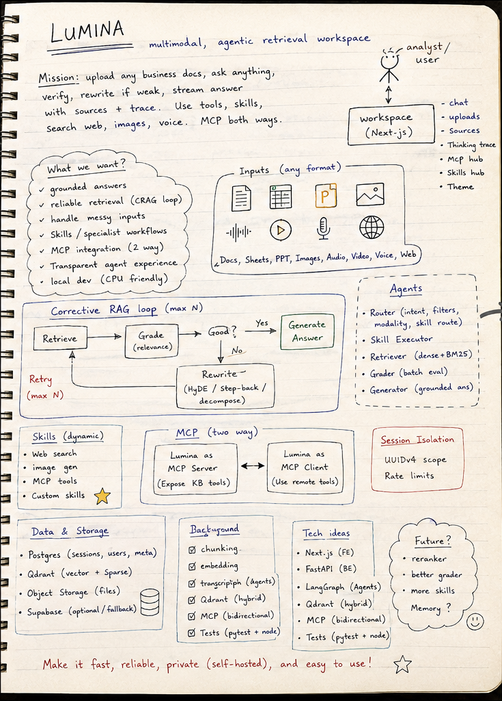
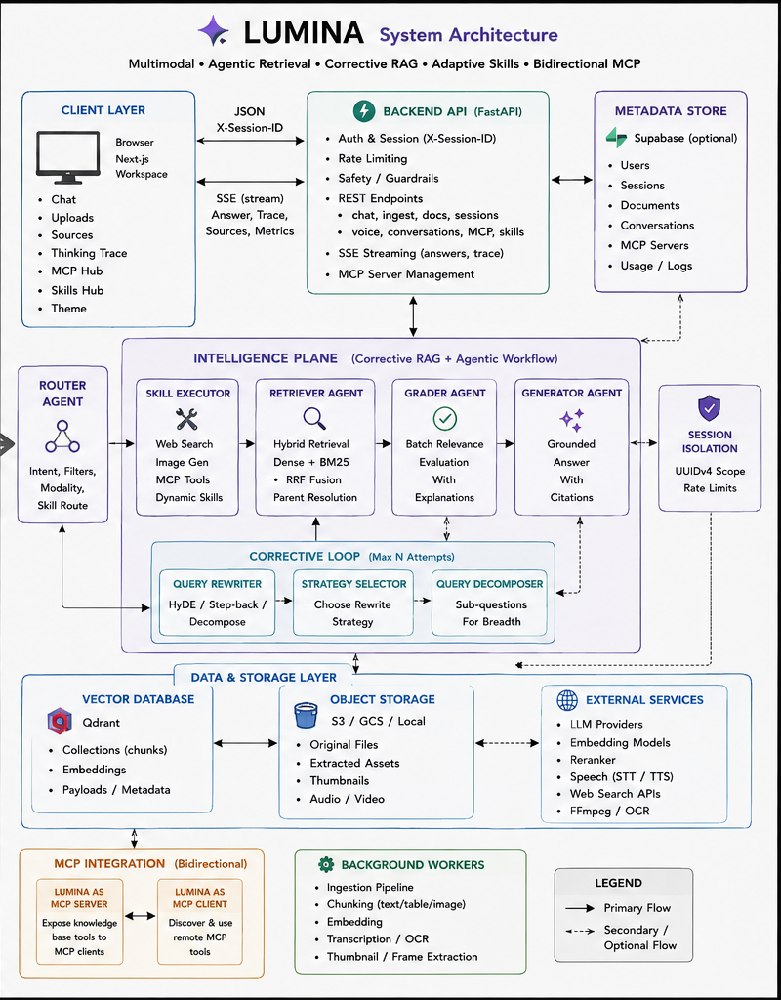
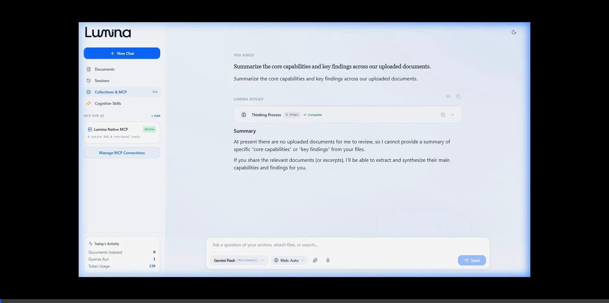
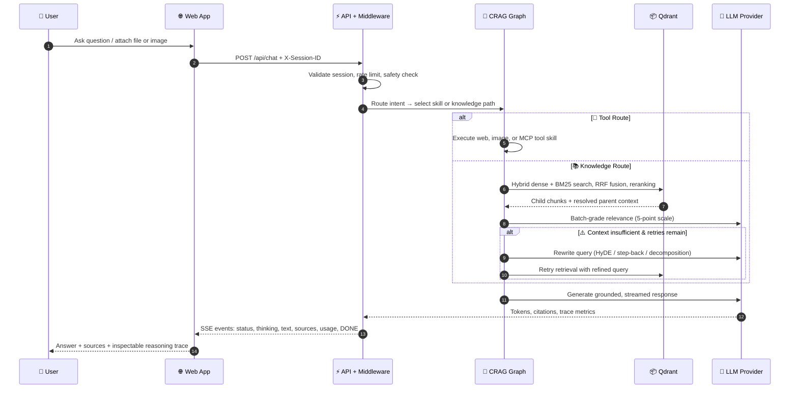

<div align="center">

  

  <h1>Lumina</h1>
  <p><strong>Enterprise-grade multimodal document intelligence powered by Corrective RAG, Adaptive Cognitive Skills, and Bidirectional MCP.</strong></p>

  <p>
    <a href="#-quick-start"></a>
    <a href="https://lumina-frontend-ma7n.onrender.com"></a>
    <a href="LICENSE"></a>
  </p>

  <p>
    
    
    
    
    
    
    
    
  </p>

  <br />

  <p><em>Upload any document. Ask any question. Get grounded, source-cited answers with full agent transparency.</em></p>

</div>

---

## 📋 Table of Contents

- [What is Lumina?](#-what-is-lumina)
- [Live Demo](#-live-demo)
- [Product Tour](#-product-tour)
- [Core Architecture](#-core-architecture)
- [Key Features](#-key-features)
- [Cognitive Skills System](#-cognitive-skills-system)
- [MCP Integration](#-mcp-integration)
- [Supported File Formats](#-supported-file-formats)
- [Tech Stack](#-tech-stack)
- [Quick Start](#-quick-start)
- [Configuration Reference](#-configuration-reference)
- [API Reference](#-api-reference)
- [Project Structure](#-project-structure)
- [Testing](#-testing)
- [Deployment](#-deployment)
- [Contributing](#-contributing)
- [License](#-license)

---

## 🧠 What is Lumina?

**Lumina** is a full-stack multimodal document intelligence platform that combines **Corrective Retrieval-Augmented Generation (CRAG)**, **13 adaptive cognitive skills**, and **bidirectional Model Context Protocol (MCP)** to deliver enterprise-grade question answering over private knowledge bases.

Unlike conventional RAG chatbots that retrieve once and hope for the best, Lumina's **five-agent corrective graph** actively verifies retrieval quality, rewrites queries when evidence is insufficient, and retries — ensuring answers are **grounded in actual evidence**, not hallucinated.

<div align="center">
  <table>
    <tr>
      <td align="center" width="46%"><br/><sub><strong>Where it started</strong> — the original notebook plan</sub></td>
      <td align="center" width="54%"><br/><sub><strong>Where it landed</strong> — the full system architecture</sub></td>
    </tr>
  </table>
</div>

### Why Lumina?

| Challenge | How Lumina Solves It |
| --- | --- |
| **"The AI just made up that answer"** | Corrective RAG grades evidence and rewrites queries when retrieval is weak — answers are always source-grounded |
| **"I can't see how it reached that conclusion"** | Full agent trace transparency: see which agents ran, what they thought, and how they scored evidence |
| **"It only works with text"** | Multimodal ingestion: PDFs, Word, PowerPoint, CSV, images, audio, video — all in one pipeline |
| **"I need specialized analysis"** | 13 built-in cognitive skills for contract review, financial analysis, causal reasoning, code architecture, and more |
| **"It doesn't connect to my tools"** | Bidirectional MCP: Lumina consumes external tools AND exposes its knowledge base as an MCP server for IDEs |
| **"Setting it up requires a PhD"** | Local-first design: CPU-friendly embeddings, optional cloud services, runs on a laptop |

---

## 🌐 Live Demo

Experience Lumina live — no setup required:

| Service | URL | Status |
| --- | --- | --- |
| **Frontend** | [lumina-frontend-ma7n.onrender.com](https://lumina-frontend-ma7n.onrender.com) |  |
| **Backend API** | [lumina-f779.onrender.com](https://lumina-f779.onrender.com/health) |  |
| **API Docs** | [lumina-f779.onrender.com/docs](https://lumina-f779.onrender.com/docs) |  |
| **MCP Endpoint** | [lumina-f779.onrender.com/mcp](https://lumina-f779.onrender.com/mcp) |  |

> 💡 **Note:** The live demo runs on Render free tier. The first request may take 30–60 seconds while the service wakes up.

---

## 🎬 Product Tour & Demo Video

Experience Lumina in action across live document intelligence, adaptive skills, and agent reasoning workflows:

### Part 1: Workspace, Cognitive Skills Hub & MCP Integration
> **Walkthrough:** Clean light-mode workspace, document library & live activity dashboard, the 13 built-in Cognitive Skills catalog, Model Context Protocol (MCP) Hub, and live archive retrieval streaming.

<div align="center">
  
</div>

<br />

### Part 2: Live Web Research, Model Selection & Agent Reasoning Trace
> **Walkthrough:** Model selector dropdown, live web search with Tavily tool execution, full response citation exploration, inspectable multi-agent Thinking Area / reasoning timeline, and session-isolated querying.

<div align="center">
  
</div>

<br />

### The Workspace Highlights

Lumina provides a complete research workspace — not just a chat box:

- **📚 Document Library** — Upload and manage your knowledge base with real-time ingestion status
- **💬 Conversation History** — Persistent sessions with full message history and context
- **🧠 Cognitive Skills Hub** — 13 pre-built specialist skills + custom skill creation
- **🔌 MCP Hub** — Connect external AI tools and services
- **🎨 Dark/Light Mode** — Adaptive theme with system preference detection
- **📊 Activity Dashboard** — Real-time session metrics: documents indexed, queries run, tokens consumed

### Chat Experience

- **Streaming responses** with real-time token generation
- **Source citation cards** linking answers back to specific document passages and pages
- **Agent trace timeline** showing the complete reasoning pipeline
- **Thinking area** with Timeline, Agent Matrix, and Raw Log view modes
- **Web search integration** with inline result cards
- **Image generation** with prompt refinement
- **File & image attachments** for multimodal queries
- **Model selection** (Gemini Flash, Flash Lite, and more)

---

## 🏗 Core Architecture

<div align="center">
  
</div>

### Design Principles

1. **Correct before fluent** — The graph grades retrieval quality before synthesis and can rewrite/retrieve again when evidence is insufficient
2. **Local-first by default** — Embeddings and reranking run on CPU; Qdrant can be local; Supabase is optional
3. **Observability is part of the product** — The UI consumes structured agent and thinking events, not a black-box answer
4. **Interoperability runs both ways** — Lumina is both an MCP server for IDE clients and an MCP client for external tools
5. **Privacy at the request boundary** — UUIDv4 session headers scope all requests; vector payloads retain session association

### Request Lifecycle



### Five-Agent CRAG Pipeline

```
┌─────────┐    ┌──────────┐    ┌────────┐    ┌──────────┐    ┌───────────┐
│  Router  │───▶│ Retriever │───▶│ Grader │───▶│ Rewriter │───▶│ Generator │
│          │    │           │    │        │    │          │    │           │
│ • Intent │    │ • Dense   │    │ • 5pt  │    │ • HyDE   │    │ • Source  │
│   detect │    │ • BM25    │    │   scale│    │ • Step-  │    │   grounded│
│ • Skill  │    │ • RRF     │    │ • Batch│    │   back   │    │ • Stream  │
│   route  │    │ • Rerank  │    │   grade│    │ • Decomp │    │   SSE     │
└─────────┘    └──────────┘    └────────┘    └──────────┘    └───────────┘
                                    │                │
                                    └─── retry loop ─┘
                                   (up to MAX_RETRIEVAL_RETRIES)
```

---

## ✨ Key Features

### 1. 📄 Multimodal Document Ingestion

- **Adaptive format routing** — PDFs, Word, PowerPoint, CSV/TSV/JSON, plain text, code, images, audio, and video enter a single unified pipeline
- **Intelligent chunking strategies** — Section-aware, semantic, and parent-child chunking modes automatically selected by the document analyzer
- **Contextual headers** — Document-level framing added to chunks before embedding for improved retrieval coherence
- **Visual content extraction** — Image analysis for diagrams, charts, and visual elements
- **Audio/Video processing** — Transcription and frame-level context extraction

### 2. 🔄 Corrective Hybrid RAG

- **Hybrid retrieval** — Dense BGE embeddings + BM25 sparse vectors fused with Reciprocal Rank Fusion (RRF), then reranked by CPU-friendly FlashRank cross-encoder
- **Five-agent graph** — Router → Retriever → Grader → Rewriter → Generator, with skill-executor node for tools
- **Bounded correction** — The grader evaluates evidence sufficiency; if insufficient, the rewriter applies query expansion techniques and the graph retries (configurable `MAX_RETRIEVAL_RETRIES`)
- **Grounded generation** — Source passages assembled for the generator and exposed as interactive citation cards

### 3. 🧠 Adaptive Cognitive Skills (13 Built-in)

See [Cognitive Skills System](#-cognitive-skills-system) for the full catalog.

### 4. 🔌 Bidirectional MCP

See [MCP Integration](#-mcp-integration) for setup instructions.

### 5. 🔒 Enterprise Controls

- **Session isolation** — `X-Session-ID` UUIDv4 scopes all data access
- **Rate limiting** — Sliding-window limits per session/IP
- **Content safety** — Pre-processing safety guard before graph execution
- **Dual persistence** — Supabase for cloud; local JSON fallback for zero-dependency operation
- **Provider resilience** — Multi-provider registry across Gemini, Groq, and NVIDIA

### 6. 🎛 Research Workspace UI

- Responsive Next.js 14 workspace with document library, conversations, and model selection
- **Thinking Area** with Timeline, Agent Matrix, and Raw Log modes
- Rich Markdown rendering, code blocks with syntax highlighting, tables, citations
- Web result cards, tool result cards, image generation cards
- Voice transcription and synthesis support
- Dark/Light mode with system preference detection
- Real-time activity metrics dashboard

---

## 🧠 Cognitive Skills System

Lumina ships with **13 domain-specific cognitive skills** loaded from Markdown definitions with YAML frontmatter. The three-tier skill router selects the right skill automatically:

1. **Exact trigger matching** (fastest)
2. **Micro-LLM intent expansion** with dense/sparse matching
3. **Reasoning depth fallback** (Sonnet → Opus → Fable)

### Built-in Skills Catalog

| Category | Skill | What It Does |
| --- | --- | --- |
| **🔍 Analysis** | Causal Reasoning | Root-cause analysis, 5-whys, hypothesis testing over evidence |
| **📊 Briefing** | Executive Briefing | C-suite ready summaries with key metrics and action items |
| **💻 Coding** | Code Architect | Architecture review, pattern analysis, refactoring suggestions |
| **🎨 Creative** | Prompt Architect | Structured prompt engineering and refinement |
| **📋 Data** | Structured Extraction | Extract tables, entities, and structured data from unstructured text |
| **💰 Financial** | Financial Auditor | Balance sheet analysis, ratio computation, anomaly detection |
| **⚖️ Legal** | Contract Risk | Clause-level risk scoring, redline suggestions, playbook comparison |
| **🧮 Reasoning** | Sonnet Reasoning | Balanced, practical reasoning for everyday analysis |
| **🧮 Reasoning** | Opus Reasoning | Deep deliberation for complex, ambiguous, high-stakes problems |
| **🧮 Reasoning** | Fable Reasoning | Frontier-depth reasoning for cross-domain, open-ended challenges |
| **🌐 Web** | Web Research | Live web search with Tavily, cited results inline |
| **🖼️ Image** | Image Generation | SDXL-powered image creation with prompt refinement |
| **🔧 MCP Tools** | External Tool Execution | Invoke tools from connected MCP servers |

### Custom Skills

Users can **create their own skills** directly from the UI:

```
Skills Hub → "Add Custom Skill" → Define name, description, triggers → Save
```

Custom skills are session-scoped and fully integrated with the skill router.

---

## 🔌 MCP Integration

### Lumina as MCP Server (for IDEs)

Connect Lumina's knowledge base to **Cursor, Windsurf, Claude Desktop**, or any MCP-compatible client:

**HTTP (Cursor / Windsurf):**
```json
{
  "mcpServers": {
    "lumina-rag": {
      "url": "http://localhost:8000/mcp"
    }
  }
}
```

**stdio (Claude Desktop):**
```json
{
  "mcpServers": {
    "lumina-rag": {
      "command": "python",
      "args": ["-m", "app.mcp_server"],
      "cwd": "/absolute/path/to/Lumina/backend"
    }
  }
}
```

**Exposed Tools:**
- `query_knowledge_base` — Query Lumina's indexed documents
- `list_documents` — List all indexed documents

### Lumina as MCP Client (consuming external tools)

From the **MCP Hub** in the UI:
1. Register an SSE-capable MCP server endpoint
2. Test the connection
3. Discover available tool schemas
4. The CRAG graph automatically routes queries to matched tools

---

## 📁 Supported File Formats

| Format | Extensions | Processing Pipeline | Output |
| --- | --- | --- | --- |
| **PDF** | `.pdf` | PyMuPDF extraction + hierarchy-aware chunking | Searchable passages, tables, visual context |
| **Word** | `.docx` | `python-docx` structured parsing | Headings, body text, tables as retrieval context |
| **PowerPoint** | `.pptx` | `python-pptx` slide extraction | Slide content, notes, and tables |
| **Spreadsheets** | `.csv`, `.tsv` | Adaptive tabular parser | Structured data as searchable text |
| **JSON** | `.json` | Structured data flattening | Key-value pairs as retrieval context |
| **Text/Code** | `.txt`, `.md`, `.py`, `.js`, etc. | Native text parsing | Formatting-preserving chunks |
| **Images** | `.png`, `.jpg`, `.webp` | Multimodal vision analysis | Visual Q&A and image-aware responses |
| **Audio** | `.mp3`, `.wav`, `.m4a` | Whisper transcription pipeline | Timestamped transcript retrieval |
| **Video** | `.mp4`, `.avi`, `.mov` | Frame extraction + visual analysis | Frame-level context for retrieval |

---

## 🛠 Tech Stack

### Backend

| Layer | Technology | Purpose |
| --- | --- | --- |
| **Framework** | FastAPI (async) | High-performance API with OpenAPI docs |
| **AI Orchestration** | LangGraph | Corrective RAG graph with five-agent pipeline |
| **Vector Store** | Qdrant (local or cloud) | Hybrid dense + sparse retrieval with RRF |
| **Embeddings** | BGE (BAAI/bge-small-en-v1.5) | CPU-friendly dense embeddings |
| **Reranking** | FlashRank (MiniLM) | CPU cross-encoder reranking |
| **LLM Providers** | Gemini, Groq, NVIDIA | Multi-provider with automatic failover |
| **MCP** | FastMCP + httpx | Bidirectional Model Context Protocol |
| **Persistence** | Supabase / Local JSON | Cloud-first with graceful local fallback |
| **Safety** | Custom guard | Content safety pre-processing |
| **Web Search** | Tavily API | Live web research with citations |

### Frontend

| Layer | Technology | Purpose |
| --- | --- | --- |
| **Framework** | Next.js 14 (App Router) | React with server components |
| **Language** | TypeScript 5 | Type-safe development |
| **Styling** | Tailwind CSS | Utility-first responsive design |
| **Icons** | Lucide React | Beautiful, consistent iconography |
| **Markdown** | react-markdown + remark/rehype | Rich content rendering with syntax highlighting |
| **Streaming** | SSE (Server-Sent Events) | Real-time response streaming |

### Infrastructure

| Layer | Technology | Purpose |
| --- | --- | --- |
| **Hosting** | Render | Automated deployments from GitHub |
| **Testing** | pytest (298 tests) + Jest | Comprehensive backend + frontend testing |
| **CI/CD** | GitHub → Render auto-deploy | Push-to-deploy pipeline |

---

## 🚀 Quick Start

### Prerequisites

- **Python 3.11+** (3.12 recommended)
- **Node.js 18.17+** (20 recommended)
- **Qdrant** — Local Docker or Qdrant Cloud
- At least one LLM API key (Gemini recommended for quickest setup)

### 1. Clone the Repository

```bash
git clone https://github.com/Vignesh-Manivasakam/Lumina.git
cd Lumina
```

### 2. Backend Setup

```bash
cd backend

# Create virtual environment
python -m venv .venv

# Activate (choose your OS)
# macOS / Linux:
source .venv/bin/activate
# Windows PowerShell:
.\.venv\Scripts\Activate.ps1

# Install dependencies
pip install -r requirements.txt

# Configure environment
cp env.example .env
```

**Minimum `.env` configuration:**

```dotenv
GEMINI_API_KEY=your_gemini_api_key
QDRANT_URL=http://localhost:6333
QDRANT_COLLECTION=multimodal_rag
```

**Start Qdrant (Docker):**

```bash
docker run -p 6333:6333 -p 6334:6334 \
  -v qdrant_data:/qdrant/storage \
  qdrant/qdrant:latest
```

**Start the Backend:**

```bash
python -m uvicorn app.main:app --reload --port 8000
```

The API is live at `http://localhost:8000` with interactive docs at `http://localhost:8000/docs`.

### 3. Frontend Setup

```bash
cd ../frontend

# Install dependencies
npm install

# Start development server
npm run dev
```

Open [http://localhost:3000](http://localhost:3000) and start using Lumina!

> 💡 **Tip:** Set `NEXT_PUBLIC_API_URL` if the backend runs on a different host/port.

---

## ⚙️ Configuration Reference

Copy `backend/env.example` to `backend/.env`. Here's the complete reference:

### LLM Provider Keys

| Variable | Required | Default | Description |
| --- | :---: | --- | --- |
| `GEMINI_API_KEY` | For Gemini | — | Google Gemini API key (primary provider) |
| `GROQ_API_KEY` | No | — | Groq API key for high-speed inference |
| `NVIDIA_API_KEY` | No | — | NVIDIA NIM API key for image gen, TTS, ASR |
| `TAVILY_API_KEY` | No | — | Tavily API key for live web search |

### Vector Store

| Variable | Required | Default | Description |
| --- | :---: | --- | --- |
| `QDRANT_URL` | Yes | `http://localhost:6333` | Qdrant endpoint |
| `QDRANT_API_KEY` | Cloud only | — | Qdrant Cloud credential |
| `QDRANT_COLLECTION` | No | `multimodal_rag` | Collection name |

### Retrieval Tuning

| Variable | Default | Description |
| --- | --- | --- |
| `EMBEDDING_MODEL` | `BAAI/bge-small-en-v1.5` | Dense embedding model |
| `EMBEDDING_DIM` | `384` | Embedding dimensions |
| `RERANK_MODEL` | `ms-marco-MiniLM-L-12-v2` | Cross-encoder reranker |
| `TOP_K_RETRIEVE` | `20` | Initial retrieval depth |
| `TOP_K_RERANK` | `5` | Final reranked context count |
| `MAX_RETRIEVAL_RETRIES` | `3` | Max corrective RAG cycles |
| `RELEVANCE_THRESHOLD` | `0.5` | Grader relevance cutoff |

### Persistence

| Variable | Required | Default | Description |
| --- | :---: | --- | --- |
| `SUPABASE_URL` | No | — | Supabase project URL |
| `SUPABASE_SERVICE_KEY` | No | — | Supabase service role key |

> 💡 **Note:** Without Supabase, Lumina falls back to local JSON persistence automatically.

### Session & Security

| Variable | Default | Description |
| --- | --- | --- |
| `SESSION_HEADER` | `X-Session-ID` | Session header name |
| `SESSION_AUTO_ISSUE` | `true` | Auto-issue session IDs |
| `CORS_ORIGINS` | `http://localhost:3000` | Allowed CORS origins |

---

## 📡 API Reference

### Core Endpoints

| Method | Endpoint | Description |
| --- | --- | --- |
| `GET` | `/health` | Liveness health check |
| `POST` | `/api/chat` | **Main chat endpoint** — streams SSE events |
| `POST` | `/api/ingest` | Upload and ingest a document |
| `GET` | `/api/ingest/{doc_id}/status` | Poll ingestion status |
| `GET` | `/api/documents` | List all indexed documents |
| `DELETE` | `/api/documents/{doc_id}` | Delete a document |

### Session Management

| Method | Endpoint | Description |
| --- | --- | --- |
| `POST` | `/api/sessions` | Create a new session |
| `GET` | `/api/sessions/{session_id}/history` | Get session chat history |
| `GET` | `/api/sessions/{session_id}/usage` | Get session usage metrics |
| `POST` | `/api/sessions/{session_id}/cleanup` | Clear session history |
| `DELETE` | `/api/sessions/{session_id}` | Delete session |

### Conversations

| Method | Endpoint | Description |
| --- | --- | --- |
| `GET` | `/api/conversations` | List conversations |
| `POST` | `/api/conversations` | Create conversation |
| `PATCH` | `/api/conversations/{id}` | Update conversation |

### Skills

| Method | Endpoint | Description |
| --- | --- | --- |
| `GET` | `/api/skills` | List all available skills |
| `POST` | `/api/skills` | Create a custom skill |
| `POST` | `/api/skills/{name}/execute` | Execute a specific skill |
| `DELETE` | `/api/skills/{name}` | Delete a custom skill |

### MCP

| Method | Endpoint | Description |
| --- | --- | --- |
| `GET` | `/api/mcp/connections` | List MCP connections |
| `POST` | `/api/mcp/connections` | Register an MCP server |
| `DELETE` | `/api/mcp/connections/{id}` | Remove an MCP connection |
| `GET/POST` | `/mcp` | MCP server endpoint for clients |

### Voice

| Method | Endpoint | Description |
| --- | --- | --- |
| `POST` | `/api/voice/transcribe` | Transcribe audio (STT) |
| `POST` | `/api/voice/synthesize` | Synthesize speech (TTS) |

### SSE Event Stream

`POST /api/chat` streams structured events:

```
data: {"type":"agent_status","agent":"router","status":"active","message":"Routing query..."}

data: {"type":"thinking","agent":"grader","content":"Evaluating 5 passages...","step":2}

data: {"type":"retrieval_info","info":{"retrieved_count":20,"reranked_count":5}}

data: {"type":"text","content":"Based on the analysis..."}

data: {"type":"sources","sources":[{"doc_title":"Report.pdf","page":4,"score":0.94}]}

data: {"type":"usage_info","usage":{"prompt_tokens":1200,"completion_tokens":450,"total_tokens":1650}}

data: [DONE]
```

**Event Types:** `agent_status` | `thinking` | `retrieval_info` | `text` | `sources` | `web_results` | `tool_result` | `image_result` | `voice_audio` | `usage_info` | `error` | `done`

---

## 📁 Project Structure

```
Lumina/
├── 📁 assets/                           # README artwork, architecture diagrams
│
├── 📁 backend/
│   ├── 📁 app/
│   │   ├── 📁 agents/                   # Five CRAG agents
│   │   │   ├── router.py                #   Intent detection & skill routing
│   │   │   ├── retriever.py             #   Hybrid search orchestration
│   │   │   ├── grader.py                #   Evidence quality scoring
│   │   │   ├── rewriter.py              #   Query expansion (HyDE/step-back/decomp)
│   │   │   └── generator.py             #   Source-grounded response generation
│   │   │
│   │   ├── 📁 graph/                    # LangGraph corrective RAG topology
│   │   │   └── crag_graph.py            #   Graph definition & state machine
│   │   │
│   │   ├── 📁 ingestion/               # Document processing pipeline
│   │   │   ├── adaptive_parser.py       #   Format-aware document parsing
│   │   │   ├── autosense_orchestrator.py#   Automatic chunking strategy selection
│   │   │   ├── parent_child_chunker.py  #   Hierarchical chunk relationships
│   │   │   ├── section_chunker.py       #   Heading-aware section splitting
│   │   │   ├── semantic_chunker.py      #   Embedding-based semantic splitting
│   │   │   ├── contextual_headers.py    #   Document-level context injection
│   │   │   ├── document_analyzer.py     #   Document structure analysis
│   │   │   ├── fast_embedder.py         #   CPU-optimized BGE embeddings
│   │   │   ├── image_extractor.py       #   Visual content extraction
│   │   │   ├── audio_pipeline.py        #   Audio transcription pipeline
│   │   │   ├── video_pipeline.py        #   Video frame extraction
│   │   │   └── pipeline.py              #   Main ingestion orchestrator
│   │   │
│   │   ├── 📁 retrieval/               # Search & ranking
│   │   │   └── qdrant_store.py          #   Hybrid dense+sparse search, RRF, rerank
│   │   │
│   │   ├── 📁 services/                # Business logic services
│   │   │   ├── provider_registry.py     #   Multi-LLM provider management
│   │   │   ├── gemini_client.py         #   Gemini API client
│   │   │   ├── llm_client.py            #   Unified LLM interface
│   │   │   ├── mcp_client.py            #   MCP client for external tools
│   │   │   ├── supabase_client.py       #   Cloud persistence layer
│   │   │   ├── safety.py                #   Content safety guard
│   │   │   ├── usage_tracker.py         #   Per-session token/query tracking
│   │   │   ├── observability.py         #   Metrics and logging
│   │   │   └── voice_service.py         #   STT/TTS service
│   │   │
│   │   ├── 📁 skills/                  # Cognitive skill system
│   │   │   ├── skill_router.py          #   Three-tier skill routing
│   │   │   ├── skill_registry.py        #   Skill discovery & management
│   │   │   ├── markdown_loader.py       #   Markdown skill definition parser
│   │   │   ├── web_search_skill.py      #   Tavily web search integration
│   │   │   ├── image_gen_skill.py       #   SDXL image generation
│   │   │   ├── mcp_tool_skill.py        #   MCP tool invocation
│   │   │   └── 📁 definitions/          #   13 built-in skill definitions
│   │   │       ├── analysis/            #     Causal reasoning
│   │   │       ├── briefing/            #     Executive briefing
│   │   │       ├── coding/              #     Code architecture review
│   │   │       ├── creative/            #     Prompt architecture
│   │   │       ├── data/                #     Structured extraction
│   │   │       ├── financial/           #     Financial auditing
│   │   │       ├── legal/               #     Contract risk analysis
│   │   │       └── reasoning/           #     Sonnet/Opus/Fable reasoning
│   │   │
│   │   ├── 📁 middleware/              # Request processing
│   │   │   ├── session.py               #   Session isolation middleware
│   │   │   └── rate_limiter.py          #   Sliding window rate limits
│   │   │
│   │   ├── 📁 routers/                 # API route modules
│   │   ├── main.py                      # FastAPI app + SSE orchestration
│   │   ├── mcp_server.py               # MCP server entry point
│   │   └── config.py                    # Centralized configuration
│   │
│   ├── 📁 tests/                       # 298 tests across 37 test files
│   ├── requirements.txt                # Python dependencies
│   └── env.example                     # Annotated environment template
│
├── 📁 frontend/
│   ├── 📁 app/                         # Next.js App Router
│   │   ├── page.tsx                    #   Main workspace page
│   │   ├── layout.tsx                  #   Root layout with metadata
│   │   └── globals.css                 #   Global styles + design tokens
│   │
│   ├── 📁 components/                  # 18 React components
│   │   ├── Sidebar.tsx                 #   Document library + activity widget
│   │   ├── Header.tsx                  #   Navigation + model selector
│   │   ├── ChatInput.tsx               #   Multimodal input composer
│   │   ├── MessageList.tsx             #   Message container
│   │   ├── MessageItem.tsx             #   Individual message rendering
│   │   ├── StreamingMessage.tsx        #   Live token streaming display
│   │   ├── MarkdownRenderer.tsx        #   Rich Markdown + code highlighting
│   │   ├── ThinkingArea.tsx            #   Agent trace visualization
│   │   ├── ThinkingStrip.tsx           #   Compact thinking indicator
│   │   ├── AgentTrace.tsx              #   Agent pipeline visualization
│   │   ├── AgentBadge.tsx              #   Agent status indicators
│   │   ├── CitationCard.tsx            #   Source citation display
│   │   ├── WebResultsCard.tsx          #   Web search result cards
│   │   ├── ToolResultCard.tsx          #   MCP tool result cards
│   │   ├── ImageResultCard.tsx         #   Generated image display
│   │   ├── EmptyState.tsx              #   Welcome state + prompt starters
│   │   ├── SkillsModal.tsx             #   Cognitive Skills Hub modal
│   │   └── MCPModal.tsx                #   MCP Hub modal
│   │
│   ├── 📁 lib/                         # Shared utilities
│   │   ├── api.ts                      #   API client + SSE streaming
│   │   └── types.ts                    #   TypeScript type definitions
│   │
│   └── 📁 __tests__/                   # Frontend contract tests
│
├── render.yaml                         # Render deployment configuration
├── LICENSE                             # MIT License
└── README.md                           # You are here
```

---

## 🧪 Testing

### Backend Test Suite

**298 tests** across **37 test files** covering every layer:

```bash
cd backend
python -m pytest tests -v
```

| Test Area | Files | What's Covered |
| --- | --- | --- |
| **CRAG Agents** | `test_router.py`, `test_retriever.py`, `test_grader.py`, `test_rewriter.py` | Intent routing, hybrid search, batch grading, query expansion |
| **Graph** | `test_skills_graph.py`, `test_pipeline_smoke.py` | End-to-end graph execution, skill integration |
| **Retrieval** | `test_qdrant_store.py`, `test_qdrant_store_weights.py`, `test_cpu_reranker.py` | Hybrid search, RRF fusion weights, cross-encoder reranking |
| **Ingestion** | `test_ingestion_pipeline.py`, `test_section_chunker.py`, `test_semantic_chunker.py`, `test_parent_child_chunker.py` | Format parsing, chunking strategies, hierarchy preservation |
| **Embeddings** | `test_fast_embedder.py`, `test_contextual_headers.py`, `test_document_analyzer.py` | CPU embeddings, contextual framing, document analysis |
| **Providers** | `test_provider_registry.py`, `test_gemini_client.py`, `test_llm_client.py` | Multi-provider routing, failover, task-specific model selection |
| **Skills** | `test_skills.py`, `test_skills_extended.py`, `test_dynamic_skills.py` | Skill loading, routing, custom skill CRUD, session scoping |
| **Security** | `test_mcp_security.py`, `test_safety.py`, `test_rate_limiter.py`, `test_session_middleware.py` | URL validation, content safety, rate limiting, session isolation |
| **Persistence** | `test_supabase_graceful.py`, `test_observability_and_usage.py` | Graceful fallback, usage tracking, metrics |
| **Voice** | `test_voice.py`, `test_voice_service.py` | Transcription, synthesis, format handling |
| **API** | `test_new_endpoints.py` | Endpoint contracts, error handling |

### Frontend Tests

```bash
cd frontend
npm test          # Unit/contract tests
npm run build     # TypeScript compilation + build verification
```

---

## 🚢 Deployment

### Render (Recommended)

The repository includes `render.yaml` for one-click deployment:

1. Fork or push the repo to GitHub
2. Connect your GitHub repo to [Render](https://render.com)
3. Render auto-detects `render.yaml` and creates two services:
   - **`lumina-backend`** — Python web service (FastAPI + Uvicorn)
   - **`lumina-frontend`** — Node web service (Next.js)
4. Set your API keys and Qdrant URL in Render environment variables

### Manual Deployment

The architecture separates cleanly for any host:

| Service | Deploy As | Requirements |
| --- | --- | --- |
| Backend | Python web service | `pip install -r requirements.txt`, Uvicorn, env vars |
| Frontend | Node/Next.js service | `npm install && npm run build`, `NEXT_PUBLIC_API_URL` |
| Vector Store | Managed service | Qdrant Cloud or self-hosted Docker |
| Database | Managed service | Supabase (optional) |

### Docker (Local Development)

```bash
# Start Qdrant
docker run -p 6333:6333 -p 6334:6334 \
  -v qdrant_data:/qdrant/storage \
  qdrant/qdrant:latest

# Backend
cd backend && pip install -r requirements.txt
uvicorn app.main:app --port 8000

# Frontend
cd frontend && npm install && npm run dev
```

---

## 🤝 Contributing

Contributions are welcome! Here's how to get started:

1. **Fork** the repository
2. **Create** a feature branch: `git checkout -b feature/amazing-feature`
3. **Commit** your changes: `git commit -m 'feat: add amazing feature'`
4. **Push** to the branch: `git push origin feature/amazing-feature`
5. **Open** a Pull Request

### Development Guidelines

- Backend: Follow existing patterns in `agents/`, `services/`, and `skills/`
- Frontend: Use TypeScript, follow component patterns in `components/`
- Tests: Add tests for new features — aim to maintain 298+ test coverage
- Commits: Use [Conventional Commits](https://www.conventionalcommits.org/)

---

## 📄 License

Lumina is released under the [MIT License](LICENSE).

```
MIT License — Copyright (c) 2026 Vignesh Manivasakam
```

---

<div align="center">

  <br />

  **Built with ❤️ by [Vignesh Manivasakam](https://github.com/Vignesh-Manivasakam)**

  <br />

  <em>Build answers your team can inspect, not just admire.</em>

  <br /><br />

  ⭐ **Star this repo** if you find it useful — it helps others discover Lumina!

  <br />

  <a href="https://github.com/Vignesh-Manivasakam/Lumina">
    
  </a>

</div>
