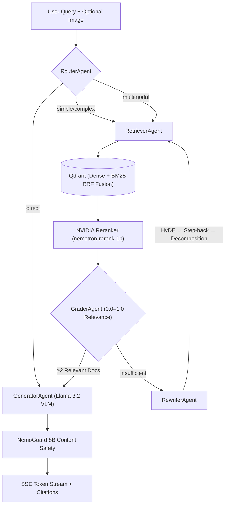

# 🧠 Lumina RAG — Multimodal Agentic Enterprise Search

[](https://www.python.org/)
[](https://github.com/langchain-ai/langgraph)
[](https://qdrant.tech/)
[](https://build.nvidia.com/)
[](https://supabase.com/)
[](#)

<p align="center">
  
</p>

Lumina RAG is a multimodal Retrieval-Augmented Generation platform powered by **LangGraph**, **Qdrant Hybrid Vector Store**, **Supabase**, and **NVIDIA NIM Cloud Endpoints**. It builds a unified searchable brain for enterprise documents, drawings, audio recordings, and video resources using a self-correcting Corrective RAG (CRAG) pipeline.

---

## 🏗️ CRAG Pipeline (LangGraph StateGraph)



### 5 Agents
| Agent | Model | Purpose |
|---|---|---|
| **Router** | `meta/llama-3.1-8b-instruct` | 4-way classification (simple, complex, multimodal, direct). Heuristic dept-filter extraction. Bypasses LLM for image-attached queries. |
| **Retriever** | — | Qdrant hybrid search (dense + BM25 sparse via FastEmbed, RRF fusion) → NVIDIA Reranker → top-K. Tracks retrieval count for loop control. |
| **Grader** | `meta/llama-3.1-8b-instruct` | LLM-scored relevance (0.0–1.0 with JSON output). Multi-fallback parsing (JSON → regex → raw float). Requires ≥2 relevant docs. |
| **Rewriter** | `meta/llama-3.1-8b-instruct` | 3 strategies cycled each retry: HyDE → Step-back → Decomposition. Sub-query support. |
| **Generator** | `meta/llama-3.2-11b-vision-instruct` | Multimodal (text + image). Chat history window (last 4 messages). Source citation. Streaming output. |

---

## 🚀 Key Features

### Multimodal Ingestion
* **PDF/DOCX/PPTX** — Docling with OCR + table extraction (tables kept intact as single chunks)
* **Audio** — Groq Whisper-large-v3 transcription
* **Video** — ffmpeg keyframe extraction + VLM captioning per frame
* **Images** — PyMuPDF extraction + VLM captioning
* **Chunking** — RecursiveCharacterTextSplitter (512 tokens, 100 overlap), 5 modalities preserved

### Search & Retrieval
* **Qdrant hybrid vectors** — dense embeddings (`nvidia/llama-nemotron-embed-vl-1b-v2`, 2048-dim) + BM25 sparse via FastEmbed
* **Reciprocal Rank Fusion (RRF)** for combining dense and sparse results
* **NVIDIA Reranker** (`nvidia/llama-nemotron-rerank-1b-v2`) for precision filtering
* **Payload indexes** on doc_id, modality, dept, file_type for filtered search

### Infrastructure
* **Content safety** — NVIDIA NemoGuard 8B pre-screens all queries with graceful fallback
* **FastMCP server** — mounted at `/mcp` on FastAPI; exposes `list_documents` and `query_knowledge_base` as standard MCP tools via SSE
* **Supabase schema** — 4 tables (documents, chunks, sessions, messages) with UUID PKs, JSONB source_chunks, cascading deletes
* **Department-scoped** uploads and queries (General, HR, Finance, Policy, Legal)
* **Background ingestion** via FastAPI BackgroundTasks with status polling (pending → processing → ready/failed)

### Frontend (Next.js/React)
* SSE token-by-token streaming with markdown table rendering
* Expandable source citations with modality icons and relevance scores
* Image attachment with client-side compression (1024px max, JPEG 0.75 quality)
* **Inline message editing** — hover pencil icon to edit any past message; Lumina truncates history and re-streams
* **Stop generation** button via AbortController
* Session persistence via localStorage

---

## 📁 Project Structure

```text
Chatbot/
├── backend/
│   ├── app/
│   │   ├── agents/            # Router, Retriever, Grader, Rewriter, Generator
│   │   ├── graph/             # LangGraph StateGraph CRAG flow (crag_graph.py)
│   │   ├── ingestion/         # Parsers (PDF/Audio/Video/Image), chunker, embedder
│   │   ├── retrieval/         # Qdrant hybrid vector store connector
│   │   ├── services/          # NVIDIA NIM client, Supabase client
│   │   ├── main.py            # FastAPI gateway, session APIs, MCP SSE mount
│   │   └── mcp_server.py      # FastMCP tool registrations
│   ├── .env                   # API keys (NVIDIA, Qdrant, Supabase, Groq)
│   ├── requirements.txt       # Python dependencies
│   └── supabase_schema.sql    # Database schema migrations
├── frontend/
│   ├── app/                   # Next.js React SPA (page.tsx — 808 lines)
│   ├── lib/                   # API client, abort controllers, type signatures
│   └── package.json           # Node dependencies
└── README.md
```

---

## 🛠️ Setup & Execution

### Backend
```bash
cd backend
pip install -r requirements.txt
python -m uvicorn app.main:app --host 127.0.0.1 --port 8000
```

### Frontend
```bash
cd frontend && npm install && npm run dev
```

Access at [http://localhost:3000](http://localhost:3000).

---

## 🛡️ Corporate Confidentiality Notice
This repository is an anonymized, public proof-of-concept. It does not contain proprietary data or internal intellectual property.
