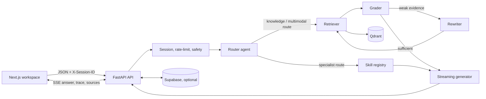

# Lumina

<div align="center">


**A multimodal, agentic retrieval workspace for asking grounded questions over documents, media, live web results, and MCP-connected tools.**

[](backend/app/main.py)
[](frontend)
[](#technology)
[](https://qdrant.tech/)
[](https://langchain-ai.github.io/langgraph/)

</div>

> [!IMPORTANT]
> Lumina is a self-hosted application, not a hosted service. Running a complete knowledge-search workflow requires a reachable Qdrant instance and at least one configured LLM provider. Supabase, voice, web search, reranking, and MCP connections are optional integrations with deliberate fallbacks where implemented.

## Contents

- [What Lumina does](#what-lumina-does)
- [Architecture and query flow](#architecture-and-query-flow)
- [Retrieval and ingestion](#retrieval-and-ingestion)
- [Skills, MCP, and voice](#skills-mcp-and-voice)
- [User experience](#user-experience)
- [Technology](#technology)
- [Quick start](#quick-start)
- [Configuration](#configuration)
- [Database setup](#database-setup)
- [API reference](#api-reference)
- [Streaming event contract](#streaming-event-contract)
- [Security and operational behavior](#security-and-operational-behavior)
- [Testing](#testing)
- [Deployment](#deployment)
- [Repository map](#repository-map)

## What Lumina does

Lumina turns uploaded content into an explorable knowledge base and provides a chat-first interface that can:

- **Ingest files asynchronously** and track each document from `processing` to `ready` or `failed`.
- **Parse text-rich office and data formats**: PDF, DOC/DOCX, PPT/PPTX, TXT, Markdown, HTML, CSV, TSV, and JSON. It also accepts standalone images, audio, and video through dedicated paths.
- **Use multimodal chunks** for text, tables, image captions, audio transcripts, and video frames.
- **Retrieve with a hierarchical CRAG loop**: select fine-grained child chunks, resolve their richer parent contexts, grade evidence, and rewrite a weak query before retrying.
- **Stream the answer and execution trace** over Server-Sent Events (SSE), including token deltas, source metadata, retrieval metrics, agent state changes, and short reasoning notes.
- **Offer specialist routes** for web search, image generation, external MCP tools, code analysis, data extraction, summarization, contract risk, deep reasoning, and causal reasoning.
- **Manage conversations, session usage, documents, and MCP server registrations** from the workspace UI.
- **Provide browser voice input and answer read-aloud** when the configured speech provider is available; the UI has a browser speech-synthesis fallback for read-aloud.

## Architecture and query flow



### Agent graph

The compiled LangGraph state machine begins at the router. Direct conversational requests go straight to generation. Specialist routes call the skill executor; image generation ends after returning its image result, while other skills feed their result into generation. Retrieval routes follow `retriever → grader → generator`; an insufficient grade routes to `rewriter → retriever` until the configured retry limit is reached.

| Node | Responsibility |
| --- | --- |
| **Router** | Applies intent heuristics first, then an LLM classifier when needed. It can contextualize follow-up questions from chat history and extracts simple department filters. |
| **Skill executor** | Dispatches the selected registered skill. |
| **Retriever** | Embeds the query, runs hybrid search, optionally reranks candidates, and resolves parent chunks for generation context. |
| **Grader** | Scores retrieved evidence in batches and decides whether it clears the configured relevance threshold. |
| **Rewriter** | Rotates through HyDE, step-back prompting, and sub-query decomposition across retrieval retries. |
| **Generator** | Builds a grounded prompt from retrieved context, attachments, history, and specialist results, then returns a streaming provider response. |

## Retrieval and ingestion

### Document pipeline

1. `POST /api/ingest` writes the upload to a sanitized, uniquely prefixed temporary file. Files larger than **50 MiB** are rejected.
2. A FastAPI background task parses and analyzes the file, so the upload response returns promptly with a document ID and `processing` status.
3. The deterministic document analyzer selects a chunking strategy from section-aware, semantic, tabular, content-aware, narrative, or fixed-size strategies.
4. The parent/child chunker produces searchable children linked to fuller parent contexts. Table chunks remain coherent rather than being treated as ordinary prose.
5. Lumina optionally produces contextual headers with the configured LLM. The header is prepended for indexing while `original_text` remains available for display.
6. `FastEmbed` generates local dense vectors. Qdrant stores embeddings and chunk payloads; sparse/BM25 representations are used when available.
7. Metadata is stored in Supabase when configured, and the document status is updated to `ready` or `failed`.

### Supported upload types

| Category | Extensions / behavior |
| --- | --- |
| Documents | `.pdf`, `.doc`, `.docx`, `.ppt`, `.pptx`, `.txt`, `.md`, `.html`, `.csv`, `.tsv`, `.json` |
| Images | `.png`, `.jpg`, `.jpeg`, `.webp`, `.bmp`, `.gif`; Lumina creates an image-caption chunk. PDFs also have embedded images extracted and captioned. |
| Audio | `.mp3`, `.wav`, `.m4a`; transcription uses the configured Groq or NVIDIA-compatible service. |
| Video | `.mp4`, `.avi`, `.mov`; the pipeline extracts/captions keyframes and processes audio where dependencies/providers support it. |

### Hybrid retrieval details

- Dense query vectors use the configured local FastEmbed model (the application default is `BAAI/bge-small-en-v1.5`, 384 dimensions).
- Qdrant stores both parent and child chunks. Retrieval targets child chunks and resolves unique parent IDs to preserve context for the generator.
- Dense and sparse rankings are fused with reciprocal-rank fusion when sparse embedding support is available.
- `TOP_K_RETRIEVE` controls candidate retrieval; `TOP_K_RERANK` controls retained candidates.
- FlashRank reranking is **opt-in** (`ENABLE_FLASHRANK=true`). If it is disabled or unavailable, the CPU reranker has a lexical fallback.
- Retrieval applies payload filters for department and session data where supplied.

## Skills, MCP, and voice

### Built-in skills

The graph registers these skills at startup: web search, image generation, MCP tool execution, deep reasoning, code analysis, summarization, data extraction, contract-risk analysis, and deep causal reasoning. The router recognizes common intent phrases and routes them to the appropriate skill; the Skills API also exposes manifests and supports direct execution.

**Web search** uses Tavily when `TAVILY_API_KEY` is set. **Image generation** uses the active NVIDIA-compatible image endpoint. Feature availability consequently depends on provider credentials and the selected provider/model.

### MCP hub

Lumina works in both directions:

1. **MCP server:** when the `mcp` package is installed, FastAPI mounts the Lumina MCP SSE application at `/mcp`. It exposes `list_documents` and `query_knowledge_base`, so a compatible client can inspect the indexed knowledge base.
2. **MCP client:** the REST MCP routes validate, test, register, list, discover, and remove remote MCP connections. Registered tools can be invoked by the MCP tool skill.

For a local MCP client configuration, point it at `http://localhost:8000/mcp`:

```json
{
  "mcpServers": {
    "lumina": {
      "url": "http://localhost:8000/mcp"
    }
  }
}
```

Remote MCP URL validation permits `http`/`https`, blocks known cloud-metadata hosts, and rejects private/internal IP addresses except localhost by default. Treat externally registered MCP servers as trusted integrations: their tools are capable of performing actions outside Lumina.

### Voice

- `POST /api/voice/transcribe` accepts an audio upload and returns `{ "text": "…" }`.
- `POST /api/voice/synthesize` accepts text and returns WAV bytes.
- NVIDIA-compatible ASR/TTS is preferred when `NVIDIA_API_KEY` is present; transcription can use Groq as an alternative. If a service is unconfigured or cannot synthesize, the API returns empty audio rather than pretending speech was generated.

## User experience

The Next.js application is a single research workspace with:

- a drag-and-drop document library, upload progress, status polling, and document deletion;
- conversation creation and selection, persisted when Supabase is configured;
- an attachment-aware chat composer with model selection, Web Search mode (`Auto`, `Always`, `Off`), image/document attachments, and browser microphone capture;
- Markdown answers, citation/source cards, generated-image cards, web-result cards, and external-tool result cards;
- a collapsible Thinking Area that presents streamed agent notes in timeline, agent matrix, and raw-log views; and
- an MCP control center that shows Lumina's exposed tools and manages external connections.

The browser creates and retains a UUID in `localStorage` under `lumina_session_uuid`, sends it as `X-Session-ID`, and uses it for API calls and conversation/usage queries.

## Technology

| Area | Implementation |
| --- | --- |
| Web client | Next.js 14, React 18, TypeScript, Tailwind CSS, Lucide icons |
| API | FastAPI, Uvicorn, Pydantic settings, SSE |
| Agent orchestration | LangGraph |
| LLM providers | NVIDIA NIM/OpenAI-compatible endpoint, Google Gemini, or Groq through a provider registry |
| Embeddings | FastEmbed local CPU model |
| Vector search | Qdrant dense vectors plus optional sparse vectors / RRF |
| Reranking | FlashRank MiniLM with a lexical fallback |
| Persistence | Supabase PostgreSQL when configured; local JSON/in-memory fallbacks for selected services |
| Parsing | PyMuPDF, pdfplumber, python-docx, python-pptx, Python standard parsing |
| Optional integrations | Groq transcription, Tavily web search, MCP, LangSmith tracing |

## Quick start

### Prerequisites

- Python 3.11+ (the Render blueprint uses Python 3.12).
- Node.js 20+ and npm.
- A running Qdrant instance. Docker is the most direct local option.
- At least one LLM provider key: NVIDIA, Gemini, or Groq. NVIDIA is the application default; Gemini is a good alternative for text generation.

Start Qdrant locally:

```bash
docker run --rm -p 6333:6333 -p 6334:6334 \
  -v qdrant_data:/qdrant/storage \
  qdrant/qdrant:latest
```

### 1. Configure and start the backend

```bash
cd backend
cp env.example .env
```

Edit `.env` to set `QDRANT_URL` and an LLM key/provider. Then create an isolated environment, install packages, and launch the API:

```bash
python -m venv .venv
source .venv/bin/activate
pip install -r requirements.txt
uvicorn app.main:app --reload --host 0.0.0.0 --port 8000
```

Verify it in a second terminal:

```bash
curl http://localhost:8000/health
```

Expected response includes `"status":"ok"` and `"service":"lumina-backend"`.

### 2. Start the frontend

```bash
cd frontend
npm ci
printf 'NEXT_PUBLIC_API_URL=http://localhost:8000\n' > .env.local
npm run dev
```

Open [http://localhost:3000](http://localhost:3000). Upload a document in the sidebar, wait for it to become ready, then ask a question about its contents.

### 3. Try the API directly

All non-exempt API routes accept an optional UUID v4 session header. Supplying one makes repeated calls deterministic from the server's perspective.

```bash
SESSION_ID="$(python -c 'import uuid; print(uuid.uuid4())')"
curl -N http://localhost:8000/api/chat \
  -X POST \
  -H 'Content-Type: application/json' \
  -H "X-Session-ID: $SESSION_ID" \
  -d '{"query":"Summarize the documents in this workspace.","web_search_mode":"off"}'
```

`-N` is important: it prevents curl from buffering the SSE stream.

## Configuration

Copy `backend/env.example` to `backend/.env`. Never commit actual provider keys. These are the most useful settings; application defaults live in `backend/app/config.py`.

| Variable | Purpose | Default / notes |
| --- | --- | --- |
| `PRIMARY_PROVIDER` | Provider selected by the registry | `nvidia`; supported registry families are NVIDIA, Gemini, and Groq |
| `NVIDIA_API_KEY`, `NVIDIA_BASE_URL` | NVIDIA/OpenAI-compatible inference credentials and base URL | Needed for NVIDIA generation, image, ASR, or TTS paths |
| `GEMINI_API_KEY`, `GEMINI_MODEL`, `GEMINI_TEXT_MODEL` | Gemini credentials and model names | Gemini provider is selected when configured/requested |
| `GROQ_API_KEY` | Groq credentials | Used by Groq provider and can support transcription |
| `QDRANT_URL`, `QDRANT_API_KEY`, `QDRANT_COLLECTION` | Vector database connection | Local default URL is `http://localhost:6333` |
| `EMBEDDING_MODEL`, `EMBEDDING_DIM` | FastEmbed model and expected vector size | App defaults: BGE small, 384; both values must match your Qdrant collection |
| `RERANK_MODEL`, `ENABLE_FLASHRANK` | Local reranker model and enable flag | FlashRank is disabled by default |
| `TOP_K_RETRIEVE`, `TOP_K_RERANK` | Candidate and final-result counts | `20` and `5` |
| `MAX_RETRIEVAL_RETRIES`, `RELEVANCE_THRESHOLD` | CRAG retry count and grading gate | `2` and `0.5` |
| `TAVILY_API_KEY` | Live web-search integration | Required for successful web search |
| `SUPABASE_URL`, `SUPABASE_SERVICE_KEY` | Metadata, conversations, messages, and usage persistence | Optional; services use local/degraded behavior when absent |
| `CORS_ORIGINS` | Comma-separated allowed frontend origins | `*` in app defaults; tighten this in production |
| `SESSION_HEADER`, `SESSION_AUTO_ISSUE` | Session boundary settings | Middleware currently reads/writes `X-Session-ID` |
| `LANGSMITH_API_KEY`, `LANGSMITH_PROJECT`, `LANGSMITH_TRACING` | LangSmith observability | Optional |

> [!NOTE]
> `backend/env.example` contains older large-embedding/Gemini examples, while the runtime defaults in `backend/app/config.py` and the Render blueprint use BGE small at 384 dimensions. Choose one embedding model/dimension pair deliberately before creating the Qdrant collection; changing dimensions requires recreating the collection.

## Database setup

Supabase is optional for basic local experimentation, but it is required for durable document registry, messages, conversations, MCP connections, and usage records.

1. Create a Supabase project.
2. In the SQL editor, apply `backend/supabase_schema.sql` first.
3. Apply the migrations in order:
   - `backend/supabase_migrations/001_users_conversations.sql`
   - `backend/supabase_migrations/002_session_rls.sql`
   - `backend/supabase_migrations/003_usage_tracking.sql`
4. Set `SUPABASE_URL` and `SUPABASE_SERVICE_KEY` in `backend/.env`, then restart the API.

The schema includes documents, chunks, sessions, messages, users, conversations, MCP connections, and usage logging. The provided RLS migration explicitly documents that the backend service role bypasses RLS; production deployments should not expose that key to clients.

## API reference

Interactive OpenAPI documentation is available at `http://localhost:8000/docs` while the backend runs.

### Core API

| Method | Path | Description |
| --- | --- | --- |
| `GET` | `/`, `/health` | Service health response. |
| `POST` | `/api/chat` | Starts an SSE chat response. Body supports `query`, optional `history`, `image_b64`, `session_id`, `web_search_mode`, `model`, and attachment fields. |
| `POST` | `/api/ingest` | Multipart upload with `file` and optional `dept`; returns a document ID and status. |
| `GET` | `/api/ingest/{doc_id}/status` | Returns background ingestion status. |
| `GET` | `/api/documents` | Lists registered documents. |
| `DELETE` | `/api/documents/{doc_id}` | Deletes document vectors and metadata. |
| `POST` | `/api/sessions` | Creates a session record. |
| `GET` | `/api/sessions/{session_id}/history` | Returns messages for a session. |
| `POST` | `/api/sessions/{session_id}/cleanup` | Deletes the session's Qdrant data and cleanup-capable metadata. |
| `DELETE` | `/api/sessions/{session_id}` | Deletes a session. |
| `GET` | `/api/sessions` | Lists sessions. |
| `GET` | `/api/sessions/{session_id}/usage` | Returns aggregated usage and latency metrics. |

### Feature APIs

| Method | Path | Description |
| --- | --- | --- |
| `POST` | `/api/voice/transcribe` | Multipart `audio`, optional `format`; returns transcript text. |
| `POST` | `/api/voice/synthesize` | JSON `{ "text", "voice" }`; returns `audio/wav`. |
| `GET/POST` | `/api/conversations` | List or create session-scoped conversations. |
| `GET/PATCH` | `/api/conversations/{conversation_id}` | Read or update a conversation. |
| `POST` | `/api/mcp/test` | Tests a candidate remote MCP endpoint. |
| `GET/POST` | `/api/mcp/connections` | List or register MCP connections. |
| `GET` | `/api/mcp/connections/{connection_id}/tools` | Discovers a connection's tools. |
| `DELETE` | `/api/mcp/connections/{connection_id}` | Removes a connection. |
| `GET` | `/api/skills`, `/api/skills/categories`, `/api/skills/{skill_name}` | Lists skills/categories or reads a manifest. |
| `POST` | `/api/skills/{skill_name}/execute` | Executes a skill directly with its payload. |
| `GET` | `/mcp` | Lumina MCP SSE application when MCP is installed. |

## Streaming event contract

`POST /api/chat` responds with `text/event-stream`. Each message is a `data: <JSON>\n\n` frame and the stream ends with `data: [DONE]`.

| Event `type` | Important fields | Meaning |
| --- | --- | --- |
| `agent_status` | `agent`, `status`, `message`, `step` | An agent became active, complete, or was skipped. |
| `thinking` | `agent`, `step`, `content` | Concise server-supplied trace note for the Thinking Area. |
| `retrieval_info` | child/reranked counts, latency, sufficiency, filters | Retrieval summary emitted before text. |
| `text` | `content` | A streamed answer token/chunk. |
| `image_result` | `image_b64`, `prompt`, `refined_prompt` | Image skill result. |
| `web_results` | `results` | Search-result records from the web skill. |
| `tool_result` | `result` | External MCP tool result. |
| `usage_info` | prompt/completion/total token estimates, latency, model, route | Per-request metering summary. |
| `sources` | source chunks, modality, page, score | Citation/source data after generation. |
| `error` | `content` | An error emitted during streaming. |

Token counts are estimates derived from word counts, not provider-billed token totals.

## Security and operational behavior

- **Session middleware:** all application endpoints other than health/docs/MCP are assigned a UUID v4 session if the header is absent. Malformed supplied UUIDs receive `401`; valid values are echoed in the response header.
- **Rate limiting:** an in-memory sliding window limits each session (or, when no session is available, IP) to 60 requests/minute and 600 requests/hour. It returns `429` and `Retry-After` when exceeded. This is process-local, so use a shared limiter for horizontally scaled production deployments.
- **Safety:** chat requests pass through a blocklist/LLM-backed safety guard before graph execution. A rejected request is returned as an SSE error event.
- **Upload handling:** filenames are sanitized, temporary names are randomized, and API upload size is capped at 50 MiB.
- **CORS:** the default is permissive for development. Set a specific comma-separated `CORS_ORIGINS` list before public deployment.
- **Observability:** LangSmith-related settings are supported. Never put provider/service-role keys in the frontend or in client-visible `NEXT_PUBLIC_*` variables.

## Testing

Run backend tests from `backend/` and frontend contract tests from `frontend/`:

```bash
cd backend
pytest -q

# Optional end-to-end dependency smoke check; needs an LLM key and downloads/uses local models.
python verify_smoke.py

cd ../frontend
npm ci
npm test
npm run build
```

The backend test suite covers routing, graph behavior, chunking, retrieval, Qdrant payload handling, safety, sessions, MCP validation, providers, voice behavior, and API contracts. The frontend test validates its SSE event dispatch contract.

## Deployment

`render.yaml` defines two Render web services:

- **`lumina-backend`** installs `backend/requirements.txt`, starts Uvicorn, and exposes `/health` for health checks.
- **`lumina-frontend`** installs and builds the Next.js application, then starts it with `next start`.

For a production deployment:

1. Provision Qdrant and configure its URL/key.
2. Configure at least one model provider and any optional integrations needed by your use case.
3. Apply the Supabase schema/migrations if persistence is required.
4. Set `CORS_ORIGINS` to the deployed frontend origin, not `*`.
5. Set `NEXT_PUBLIC_API_URL` to the public backend origin, including `https://` if required by the platform.
6. Ensure the backend has enough disk/cache capacity for FastEmbed and optional FlashRank model downloads, and enough memory for document processing.

## Repository map

```text
.
├── frontend/                         # Next.js workspace UI
│   ├── app/                          # Page, layout, global styles
│   ├── components/                   # Chat, sources, thinking area, MCP UI
│   ├── lib/api.ts                    # Typed REST/SSE client
│   └── __tests__/                    # Frontend streaming contract test
├── backend/
│   ├── app/
│   │   ├── agents/                   # Router, retriever, grader, rewriter, generator
│   │   ├── graph/                    # LangGraph CRAG state graph
│   │   ├── ingestion/                # Parsers, chunking, captions, embeddings
│   │   ├── retrieval/                # Qdrant and CPU reranking
│   │   ├── routers/                  # Voice, MCP, conversations, skills APIs
│   │   ├── services/                 # Providers, persistence, safety, MCP, usage
│   │   ├── middleware/               # Session and rate limiting
│   │   ├── main.py                   # FastAPI composition and core endpoints
│   │   └── mcp_server.py             # Lumina MCP tools
│   ├── tests/                        # Unit, contract, and integration-oriented tests
│   ├── env.example                   # Environment template
│   └── supabase_schema.sql           # Base Supabase schema
├── render.yaml                       # Render deployment blueprint
└── assets/                           # Project image assets
```

## Troubleshooting

| Symptom | Checks |
| --- | --- |
| API starts but chat fails | Confirm one provider key is set, `PRIMARY_PROVIDER` points to it, and the selected model is available to that provider. |
| Ingestion stays `processing` or becomes `failed` | Read backend logs: ingestion runs in a background task. Verify Qdrant is reachable, the embedding dimension matches the collection, and the file type is supported. |
| Vector errors after changing models | Recreate the Qdrant collection or revert `EMBEDDING_MODEL`/`EMBEDDING_DIM` to the values used to create it. |
| Web search returns no results | Set `TAVILY_API_KEY`; use `Web: Always` only when you intend to call the web skill. |
| Voice input produces no text | Configure NVIDIA or Groq transcription, verify browser microphone permission, and inspect the voice endpoint response. |
| MCP connection is rejected | Use an HTTP(S) endpoint; private-network and cloud metadata URLs are intentionally blocked. |
| Browser cannot reach the backend | Set `NEXT_PUBLIC_API_URL` correctly and add the frontend origin to `CORS_ORIGINS`. |

---

Built for transparent, inspectable knowledge workflows: upload, retrieve, verify, and cite.
