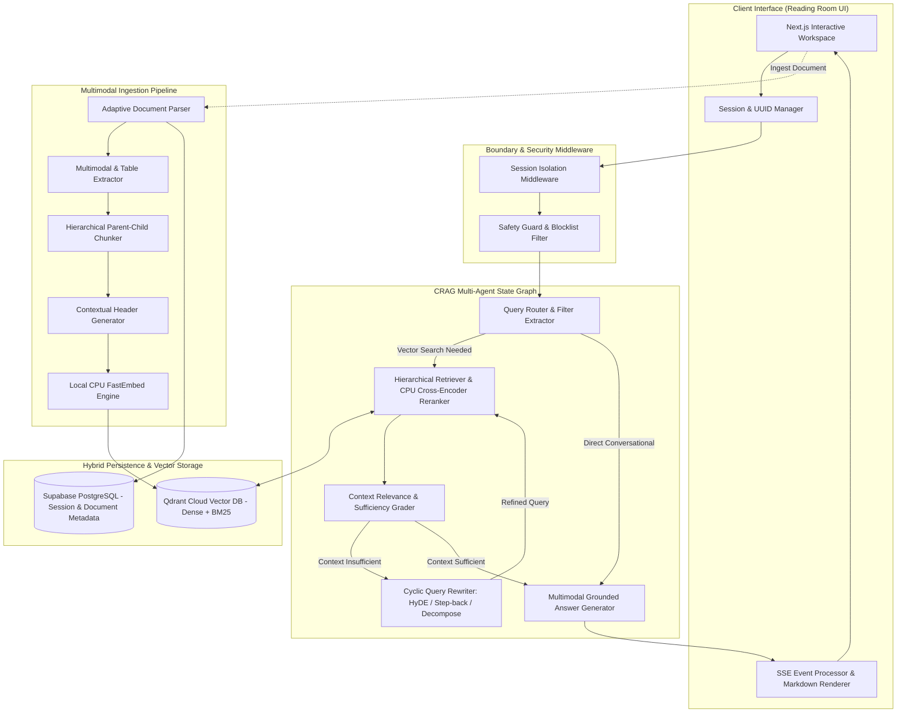
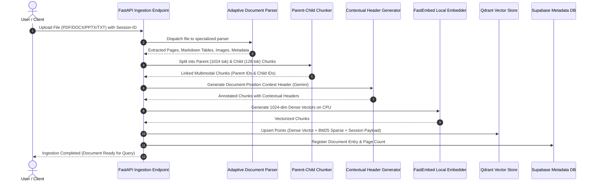
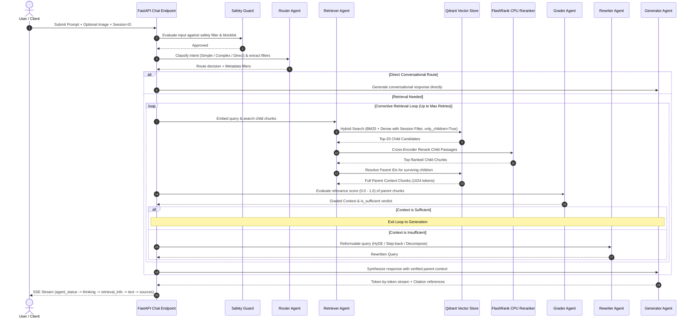

# Lumina Architectural Specification & System Blueprint

> **System Overview:** A 100% free-tier, enterprise-grade multimodal Corrective Retrieval-Augmented Generation (CRAG) system featuring hierarchical parent-child retrieval, Anthropic-style contextual document headers, multi-tenant session isolation, and real-time multi-agent reasoning traces.

---

## 1. Overall Architectural Summary

Lumina is an autonomous, multi-agent multimodal Retrieval-Augmented Generation (RAG) system engineered to provide enterprise-level document intelligence without relying on expensive GPU clusters, paid proprietary vector storage, or recurring SaaS subscriptions.

### Core Architectural Philosophy
1. **Zero Recurring Cloud Cost (100% Free Tier):** Designed from the ground up to operate entirely on generous free-tier APIs and local CPU-optimized execution environments.
2. **Local-First Search Infrastructure:** Embedding generation and cross-encoder reranking are executed locally on CPU via optimized ONNX runtimes, eliminating vendor latency, token quotas, and cloud egress costs.
3. **Agentic Self-Correction (Corrective RAG - CRAG):** Rather than blindly relying on the first retrieval pass, Lumina orchestrates an active state machine of specialized autonomous agents (Router, Retriever, Grader, Rewriter, and Generator) that evaluate retrieved evidence and autonomously reformulate queries if information is incomplete.
4. **Precision-Context Coexistence (Parent-Child Hierarchy):** Solves the classic RAG dilemma—small chunks are better for vector matching, but large chunks are needed for coherent LLM understanding—by indexing small child chunks for search and resolving them to parent contexts for synthesis.
5. **Contextual Awareness:** Injects LLM-generated document-level summary headers onto every chunk before embedding, drastically improving dense semantic retrieval recall.
6. **Multi-Tenant Privacy by Design:** Implements strict session isolation across both vector indices and relational databases, ensuring tenant data never leaks across concurrent user sessions.
7. **Transparent Observability:** Streams agent thoughts, state transitions, and generated tokens in real-time via Server-Sent Events (SSE) into a dark parchment "Reading Room" user interface.

---

## 2. Architectural Details

### 2.1 Multi-Tenant Session Isolation
* **Session Identifier (UUID v4):** Every interaction requires a valid session UUID header. If missing, the boundary middleware automatically generates and injects one.
* **Vector Index Payload Filtering:** Every vector point stored in Qdrant contains an indexed `session_id` payload field. All vector and BM25 searches automatically inject an immutable filter condition (`session_id = <requesting_session_uuid>`), preventing cross-tenant document visibility.
* **Database Row-Level Security (RLS):** Supabase database tables enforce row-level access control tied to the session identifier, ensuring chat histories and document registries remain strictly private.

### 2.2 Corrective RAG (CRAG) 5-Agent State Graph
The retrieval and generation lifecycle is managed as a compiled state graph with explicit node boundaries:
* **Router Agent:** Analyzes the raw query to categorize intent into `simple` (factual lookup), `complex` (multi-step reasoning), or `direct` (greetings/conversational). It automatically extracts metadata filter tags (such as department or document type).
* **Retriever Agent:** Executes hybrid search across child chunks, runs local cross-encoder reranking, and expands surviving child matches to their full parent chunks.
* **Grader Agent:** Evaluates each retrieved parent chunk against the query, assigning relevance scores between 0.0 and 1.0. It determines whether the collective context meets the sufficiency threshold for accurate generation.
* **Rewriter Agent:** Activated when the grader flags retrieved context as insufficient. It utilizes three rotating strategies across retries:
  * *Hypothetical Document Embedding (HyDE):* Generates a hypothetical answer to extract dense semantic keywords.
  * *Step-Back Prompting:* Broadens the query to capture foundational high-level principles.
  * *Sub-Query Decomposition:* Splits complex queries into atomic, independent sub-questions.
* **Generator Agent:** Synthesizes the final answer using retrieved grounded context and conversation history, attaching exact citation anchors and streaming tokens back in real time.

### 2.3 Two-Tier Hierarchical Parent-Child Chunking
* **Child Chunks (128 tokens, 32 overlap):** Created for high-resolution vector and sparse keyword indexing. Small chunks prevent embedding dilution and allow precise semantic targeting.
* **Parent Chunks (1024 tokens, 128 overlap):** Retained as rich context windows. When a child chunk matches a query, the system maps the child's `parent_id` back to the parent chunk, giving the LLM complete surrounding context without the noise of unrelated paragraphs.

### 2.4 Anthropic-Style Contextual Headers
* During ingestion, each chunk is passed through an LLM synthesis step that prepends a 1-sentence contextual description (e.g., *"This section discusses quarterly cloud infrastructure expenditures in the 2025 Financial Summary"*).
* The contextual header is prepended to the text representation before embedding, ensuring dense vectors capture both localized semantics and document-level position.
* The original unmodified text is preserved separately for accurate user citations.

### 2.5 Real-Time Observability & SSE Streaming
* Communication between client and server uses Server-Sent Events (SSE).
* The stream yields distinct typed events:
  * `agent_status`: Emitted as agents transition between `active`, `complete`, and `skipped`.
  * `thinking`: Emits the internal rationale and decision-making logic of each agent.
  * `retrieval_info`: Delivers retrieval metrics, child matches, and reranker scores.
  * `text`: Delivers incremental answer tokens.
  * `sources`: Transmits verified citation metadata (document title, page number, modality).
  * `error`: Transmits structured error messages without crashing the client interface.

---

## 3. Complete Technology Stack

| Layer / Component | Technology Selected | Execution Profile & Free Tier Specs |
| :--- | :--- | :--- |
| **Primary LLM & Multimodal Vision** | Google Gemini 2.0 Flash | Cloud API (15 RPM, 1M TPM Free Tier limit) |
| **Dense Vector Embeddings** | FastEmbed BGE-Large-EN-v1.5 / BGE-M3 | Local CPU ONNX Runtime (1024-dimensional vectors, ~400 MB RAM) |
| **Sparse Vector Retrieval** | Qdrant BM25 Tokenizer | Local CPU Sparse Vector Encoding with inverse document frequency |
| **Cross-Encoder Reranker** | FlashRank MiniLM / Ranker | Local CPU ONNX Runtime (~30 MB memory footprint, sub-30ms latency) |
| **Vector Database Engine** | Qdrant Cloud | Managed Cloud Vector Database (1 GB Free Cluster with HNSW indexing) |
| **Relational Metadata Store** | Supabase (PostgreSQL) | Managed Cloud Database (500 MB Postgres Free Tier with Row Level Security) |
| **Audio Speech-to-Text (STT)** | Groq Whisper Large V3 | Cloud API (~7,000 tokens/min Free Tier limit) |
| **Document Parsers** | Docling & PyMuPDF (fitz) | Local CPU Table Structure Extraction and Document Text Extraction |
| **Office File Parsers** | python-docx / python-pptx | Local CPU Structured Paragraph, Shape, and Table Extraction |
| **HTML / Text Parsers** | BeautifulSoup4 / Built-in Readers | Local CPU DOM and Plaintext Extraction |
| **Backend API Framework** | FastAPI + Uvicorn | Python Asynchronous Framework with Pydantic v2 Type Validation |
| **Multi-Agent Orchestration** | LangGraph + LangChain Core | Stateful Directed Graph Engine with Conditional Edge Routing |
| **Frontend Web Interface** | Next.js 14 (App Router) + React 18 | TypeScript Fullstack Application with Responsive Tailwind CSS |
| **Real-Time Client Protocol** | Server-Sent Events (EventSource SSE) | Streaming HTTP Connection with Asynchronous JSON Event Multiplexing |

---

## 4. Complete Data Flow

### 4.1 Document Ingestion Flow

### 4.2 Query, Retrieval & Corrective Generation Flow

---

## 5. End-to-End Architectural Pipeline Stages

### Stage 1: Document Parsing & Multimodal Ingestion
* **Format Detection:** Ingested files are dynamically inspected by file extension and MIME type.
* **Specialized Parsing Engines:**
  * *PDFs:* Processed via Docling for structure-aware parsing with a fast fallback to PyMuPDF. Table boundaries are detected and converted directly to structured Markdown tables.
  * *Word Documents (DOCX):* Parsed via python-docx, preserving paragraph hierarchy, bullet structures, and tabular data.
  * *Presentations (PPTX):* Parsed slide-by-slide via python-pptx, capturing slide text, speaker notes, and embedded tables.
  * *Text/Markdown/HTML:* Read with UTF-8 encoding and sanitized.
  * *Audio/Speech:* Audio files (MP3/WAV) are transcribed into text documents via Groq Whisper Large V3.
* **Uniform Output Contract:** Every parser yields a standardized structure containing per-page text, extracted Markdown tables, and document metadata.

### Stage 2: Hierarchical Two-Tier Chunking
* **Parent Chunking:** Text is partitioned into 1024-token parent blocks with 128-token overlaps using semantic boundary separators (paragraphs, line breaks, sentence ends).
* **Child Chunking:** Each parent chunk is subdivided into 128-token child blocks with 32-token overlaps.
* **Relational Key Binding:** Each child chunk is assigned a deterministic ID and tagged with its corresponding `parent_id`.
* **Table Handling:** Tables are preserved as individual parent units in Markdown format; oversized tables are subdivided by rows as child units to ensure exact cell matchability.

### Stage 3: Contextual Header Synthesis
* **Document-Position Synthesis:** Every chunk is passed to Gemini 2.0 Flash with a prompt instructing it to produce a one-sentence contextual framing of the passage relative to the entire document.
* **Header Attachment:** The contextual header is prepended to the chunk's indexing representation. The original unmodified text is preserved in `original_text` for raw citation display.

### Stage 4: Local Vectorization & Storage
* **Dense Vectorization:** Ingestion representations are converted into 1024-dimensional dense vectors on the CPU using the local FastEmbed BGE-Large-EN-v1.5 model.
* **Sparse Vectorization:** Chunks are tokenized using Qdrant's BM25 sparse encoder to generate term-frequency and inverse-document-frequency indices.
* **Atomic Upsert:** Vectors, sparse matrices, hierarchical IDs, contextual headers, and tenant session IDs are upserted into Qdrant Cloud.

### Stage 5: Ingestion Security & Session Isolation
* **Payload Scoping:** Every stored vector point includes an indexed `session_id` attribute.
* **Metadata Persistence:** Document registry details (document ID, name, page count, creation timestamp) are stored in Supabase with session access controls. If Supabase is offline or unconfigured, the system automatically falls back to in-memory session mode.

### Stage 6: Query Intake & Safety Screening
* **Session Authorization:** Requests are screened at the API boundary for valid UUID formats.
* **Safety Guard:** Queries pass through a local safety filter and blocklist screening before invoking LLM or agent nodes.

### Stage 7: CRAG Intent Routing & Filter Extraction
* **Classification:** Router Agent categorizes the query into `simple`, `complex`, or `direct`.
* **Filter Heuristics:** Automatically detects organizational keywords (e.g., department names, document types) and compiles them into structured vector metadata filters.
* **Fast-Path Decision:** Conversational queries (e.g., "Hello", "Who are you?") bypass the retrieval pipeline and route directly to generation.

### Stage 8: Two-Phase Retrieval & CPU Cross-Encoder Reranking
* **Phase A - Granular Child Search:** Executes hybrid search (Reciprocal Rank Fusion of BM25 sparse matching and dense cosine similarity) restricted strictly to child chunks (`is_parent = False`) under the active session filter.
* **Phase B - Cross-Encoder Reranking:** Top 20 retrieved child candidates are evaluated against the query using FlashRank MiniLM on the CPU, producing refined cross-attention relevance scores.
* **Phase C - Parent Resolution:** Top surviving child chunks are mapped back to their `parent_id`s, and full 1024-token parent passages are fetched to assemble the complete context window.

### Stage 9: Context Relevance Grading & Sufficiency Evaluation
* **Evaluator Agent:** Grader Agent inspects the retrieved parent passages against the user query.
* **Binary Relevance & Scoring:** Assigns a score (0.0 to 1.0) and evaluates whether the information is sufficient to formulate an accurate, non-hallucinatory answer.
* **Threshold Gate:** If context relevance exceeds the threshold, execution transitions to Generation; otherwise, execution branches to the Query Rewriter.

### Stage 10: Corrective Query Rewriting & Cyclic Re-Retrieval
* **Strategy Cycling:**
  * *Retry 1 (HyDE):* Generates a hypothetical ideal response and uses its semantic signature to query the vector store.
  * *Retry 2 (Step-Back):* Constructs a generalized, high-level abstraction of the question to retrieve broader conceptual context.
  * *Retry 3 (Decomposition):* Breaks multi-part questions into atomic sub-queries and aggregates child hits across all sub-questions.
* **Loop Termination:** Re-retrieved context feeds back to the Grader. If the maximum retry count is reached, the system falls back to the best available candidate passages rather than stalling.

### Stage 11: Generation, Source Attribution & Real-Time Token Streaming
* **Grounded Generation:** Generator Agent formats a citation-enforced prompt containing conversation history, grounded parent passages, and multimodal image references.
* **Token-by-Token Streaming:** Output is streamed to the client in real time via SSE.
* **Citation Binding:** Accurate citation anchors (source document, page number, confidence score) are attached at the end of the payload for interactive UI rendering.

---

## 6. Summary of Architectural Strengths & Evolution Opportunities

| Architectural Dimension | Current Implementation Strengths | Potential Future Enhancements |
| :--- | :--- | :--- |
| **Cost & Infrastructure** | 100% free-tier; zero GPU dependencies; local CPU ONNX embedding/reranking. | Optional local self-hosted vector store (e.g., embedded LanceDB or DuckDB) for full offline capabilities. |
| **Retrieval Accuracy** | Hybrid dense + BM25 search; two-tier parent-child resolution; Anthropic contextual headers. | Graph-augmented RAG (knowledge graph traversal for multi-hop cross-document reasoning). |
| **Agentic Reliability** | Corrective CRAG state machine; active grading; 3-stage query rewriting fallbacks. | Adaptive agent planning with dynamic tool invocation (e.g., calculator, code sandbox). |
| **Multi-Tenancy** | Strict session isolation via UUID payload filtering in Qdrant and Supabase RLS. | Role-Based Access Control (RBAC) and organization-wide multi-user document sharing. |
| **User Experience** | Real-time SSE token streaming; multi-agent live thinking traces; dark parchment Reading Room UI. | Voice input/output streaming and interactive document canvas with visual citation bounding boxes. |
