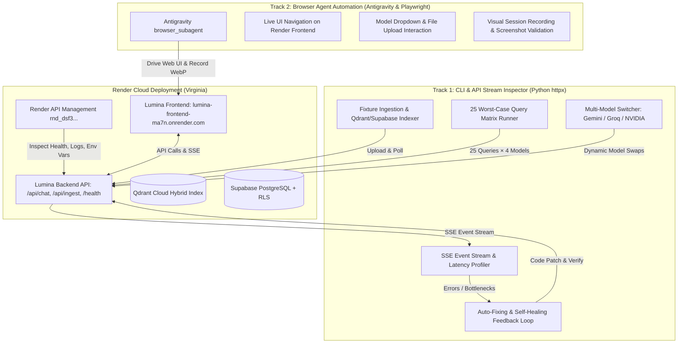

# Lumina Enterprise-Grade E2E Automation Testing, Multi-Model Evaluation & Auto-Fixing Plan

> **Objective:** Execute full end-to-end automated testing, worst-case stress evaluation (25+ edge queries across 5 suites), dynamic model switching benchmarking (Gemini, Groq, NVIDIA), Render cloud environment synchronization & verification (`rnd_dsf3Wg1vpynzUzZJgJFbX7GdOPVZ`), browser automation via Antigravity `browser_subagent` & Playwright, test fixture ingestion, and iterative auto-fixing.

---

## 1. System Architecture & Dual-Track Testing Topology



---

## 2. Render Deployment & Cloud Environment Access

### 2.1 Render Environment Details & API Access
- **Render API Key:** `rnd_dsf3Wg1vpynzUzZJgJFbX7GdOPVZ`
- **Render Management API Endpoint:** `https://api.render.com/v1/services`
- **Deployed Services:**
  - **Frontend Web Service:** `https://lumina-frontend-ma7n.onrender.com/` (Next.js 15, React 19)
  - **Backend Web Service:** `lumina-backend` on Render (`https://lumina-backend.onrender.com` or discovered service URL via Render API)
- **Render Automation Manager ([`backend/tests/render_manager.py`](file:///f:/AI/Lumina/backend/tests/render_manager.py)):**
  - Authenticate using `Bearer rnd_dsf3Wg1vpynzUzZJgJFbX7GdOPVZ`.
  - Fetch active service status, deploy IDs, and environment variables.
  - Stream live deployment build and runtime logs for troubleshooting.
  - Verify `/health` endpoints on both local and Render environments.

---

## 3. Best Browser Automation Agent Tooling & Antigravity Connection

### 3.1 Industry Tooling Landscape Analysis (2026)

| Tool / Technology | Strengths | Best Use Case | Lumina Test Integration |
| :--- | :--- | :--- | :--- |
| **Antigravity `browser_subagent`** | Built directly into IDE, native WebP session recording, accessibility DOM snapshots, autonomous interaction | Live visual E2E UI validation, interactive user flows on Render | **Primary tool** for visual & interactive web testing in Antigravity |
| **Playwright (Code-First & MCP)** | Deterministic assertions, network interception, multi-browser headless engine | High-throughput scripted regression testing | Secondary headless runner for local Next.js verification |
| **Browser-Use / CDP** | Autonomous goal-directed navigation via direct Chrome DevTools Protocol | Exploratory edge-case recovery | Fallback for open-ended UI tasks |

### 3.2 Antigravity Connection Workflow
1. Use `browser_subagent` to open `https://lumina-frontend-ma7n.onrender.com/`.
2. Verify document library renders uploaded fixtures.
3. Test UI model switcher dropdown (Gemini Flash, Groq Llama 3.3, NVIDIA Nemotron).
4. Test drag-and-drop / file upload modal with `dense_table.csv`, `policy_document.pdf`, and `system_architecture.png`.
5. Execute live interactive queries and capture screenshots/recordings of agent thinking accordion, citation side-sheets, and streaming responses.

---

## 4. Multi-Model Dynamic Switching Evaluation Matrix

Lumina supports dynamic model switching per-request via the `model` parameter in `ChatRequest` and the UI selector:

| Provider | Model ID | Strengths / Role | Evaluation Focus |
| :--- | :--- | :--- | :--- |
| **Google Studio** | `gemini-flash-latest` / `gemini-2.0-flash` | Multimodal native, 1M token context, high-speed vision & text | Vision reasoning, complex PDF synthesis, general chat |
| **Google Studio** | `gemini-flash-lite-latest` | Ultra-low latency, lightweight text generation | Sub-100ms TTFT, fast document queries, quick summaries |
| **Groq Cloud** | `llama-3.3-70b-versatile` | Ultra-fast open-weights inference (700+ tokens/sec on LPU) | High-throughput text generation, dense tabular reasoning |
| **NVIDIA NIM** | `nvidia/nemotron-mini-4b-instruct` / `nvidia/nemotron-3-ultra-550b` | Enterprise reasoning, structured logic | Policy clause extraction, CRAG verification, complex edge cases |

### Dynamic Switching Tests:
1. **Per-Query Model Switching:** Sending identical queries with different `model` parameter values to verify correct provider dispatch without server restart.
2. **Provider Failover & Fallback:** Testing graceful degradation when a primary provider is unavailable or rate-limited.
3. **Throughput & Latency Benchmarks:** Recording Time-to-First-Token (TTFT), total response time, and token generation speed per model.

---

## 5. Test Fixtures Preparation & Automated Ingestion

### 5.1 Fixtures in [`backend/tests/fixtures/`](file:///f:/AI/Lumina/backend/tests/fixtures/):

1. **`dense_table.csv` (Dense Table & SaaS Financial Metrics):**
   - Multi-department, 4-quarter SaaS financial balance sheet including Cloud ARR, Net Retention Rate (NRR), Gross Margin (GM), Customer Acquisition Cost (CAC), Lifetime Value (LTV), Headcount, and Server p95 latency.
   - Contains numerical density, percentages, currency, and multi-tier categorical rows to test tabular parsing and precision calculation queries.

2. **`policy_document.pdf` (Enterprise Security & Compliance PDF):**
   - Multi-page structured document covering Data Classification (Public, Internal, Confidential, Restricted), Remote Work Device Policies, Tier-3 Jurisdiction Exceptions, Cryptographic Key Rotation Schedules, and Incident Escalation Timelines.
   - Built to stress-test Section-Aware hierarchical chunking, Contextual Header generation, Parent-Child (1024 parent / 128 child) retrieval, and cross-section exception reasoning.

3. **`system_architecture.png` (Multimodal Architectural Diagram):**
   - High-contrast, clean microservice and agentic pipeline diagram illustrating Client Gateway -> Session Isolation -> CRAG Routing -> Hybrid FastEmbed/BM25 -> Qdrant/Supabase -> FlashRank Reranker -> LLM Generation.
   - Designed to stress-test Vision Optical Character Recognition (OCR), entity relationship tracing, and multi-hop visual reasoning.

### 5.2 Ingestion Script ([`backend/tests/upload_fixtures.py`](file:///f:/AI/Lumina/backend/tests/upload_fixtures.py))
- Uploads fixtures to `/api/ingest` with department tags.
- Polls `/api/ingest/{doc_id}/status` until `completed`.
- Verifies document metadata in Supabase and vector payload tags in Qdrant.

---

## 6. The 25 Worst-Case Stress Query Matrix (5 Tests × 5 Scenarios)

### TEST 1: Tavily Live Web Search (Skill Routing & Live Internet QA)
*Target: Real-time queries, live citation verification, web fallback, polysemous queries.*

- **Query 1.1 (Temporal Breaking News):**  
  `"What are the latest developments and releases in frontier AI models and open weights in 2026? Provide source links."`  
  *Expected:* Router selects `web_search`; Tavily executes; returns live sources with valid URLs, domain tags, and synthesized summary.
- **Query 1.2 (Polysemous & Ambiguous Entity Disambiguation):**  
  `"What is Mercury's current market cap and latest quarterly earnings?"` (Distinguishing Mercury Bank vs Planet Mercury vs Element).  
  *Expected:* Rewriter / Tavily disambiguates to Mercury Technologies/Fintech or prompts disambiguation with accurate current financial data.
- **Query 1.3 (Contradictory / Disputed Fact-Checking):**  
  `"Fact check: Has Quantum Computing officially broken RSA-2048 encryption as of this month? Cite specific research sources."`  
  *Expected:* Accurate synthesis of current cryptographic status with exact source citations, refuting hype without hallucinations.
- **Query 1.4 (Deep Technical & Jargon-Dense Query):**  
  `"Compare the memory bandwidth and FP8 Tensor Core throughput of NVIDIA Blackwell B200 vs AMD Instinct MI300X based on recent official benchmarks."`  
  *Expected:* Exact numerical hardware specifications extracted from live web results.
- **Query 1.5 (API Fallback & Resilience):**  
  `"Search for real-time traffic status on I-95 North near Richmond"` (Simulating potential rate-limit / timeout handling).  
  *Expected:* Clean degradation with informative error or fallback note without crashing the SSE stream or hanging the UI.

---

### TEST 2: Text-to-Image Generation (Image Skill & Fallback)
*Target: Prompt refinement, artistic stylization, spatial reasoning, safety filtering.*

- **Query 2.1 (Ultra-Detailed Stylized Artwork):**  
  `"Generate an image of a futuristic cyberpunk laboratory in Neo-Kyoto at twilight, neon reflections on wet asphalt, cinematic volumetric lighting, 8k resolution octane render."`  
  *Expected:* Router selects `image_gen`; prompt refiner expands prompt; returns valid image payload with URL / b64.
- **Query 2.2 (Multi-Subject Spatial Composition):**  
  `"Create an image featuring a crystal sphere on the left side, an antique brass compass in the center, and an open leather-bound book on the right on a dark oak desk."`  
  *Expected:* Refined prompt retains strict spatial positioning keywords; image generated.
- **Query 2.3 (Abstract Surrealist Visualization):**  
  `"Generate a visual representation of quantum entanglement showing glowing threads connecting two split atoms across a cosmic nebula."`  
  *Expected:* Rich conceptual refinement and coherent rendering.
- **Query 2.4 (Border-Safety & Ambiguity Sanitization):**  
  `"Generate an image of a dramatic battlefield scene with knight armor and glowing energy shields in an ancient ruin."`  
  *Expected:* Safety guard does not falsely trigger on fantasy armor/knights; prompt refiner cleanses any violent edge-cases; clean generation.
- **Query 2.5 (High-Concurrency / Fallback Verification):**  
  `"Generate a minimalist vector logo of a luminescent owl perched on a silicon chip."`  
  *Expected:* Verifies fast generation (<5s) or transparent fallback to Flux/Pollinations without stream disconnection.

---

### TEST 3: Document QA — Dense Table & SaaS Metrics (`dense_table.csv`)
*Target: Tabular chunking, cross-column math, zero-hallucination check, high-density cell retrieval.*

- **Query 3.1 (Cross-Quarter Percentage Calculation):**  
  `"Based on the uploaded financial table, what was the Cloud ARR in Q1 2025 versus Q4 2025, and what is the exact percentage growth between them?"`  
  *Expected:* Retrieves exact Q1 ($42.5M) and Q4 ($104.2M); calculates +145.17% growth correctly.
- **Query 3.2 (Multi-Metric Correlation & Margin Analysis):**  
  `"How did the Gross Margin evolve from Q1 to Q4 2025, and how many basis points did it gain?"`  
  *Expected:* Retrieves 74.2% to 82.4%; outputs +820 bps gain with source citation.
- **Query 3.3 (Zero-Hallucination & Out-of-Bounds Query):**  
  `"What was the Marketing CAC payback period in Q3 2024 according to the document?"`  
  *Expected:* Correctly states that Q3 2024 is not present in the document; does NOT invent figures.
- **Query 3.4 (Filtered Conditional Aggregation):**  
  `"List all metrics that showed more than 100% YoY growth in the uploaded report."`  
  *Expected:* Identifies Cloud ARR (+145%), Net Retention Rate (+1600 bps), Active Enterprise Logos (+285%).
- **Query 3.5 (Infrastructure Performance & Cost Correlation):**  
  `"What was the impact of ONNX CPU reranking on p95 latency and infrastructure costs per 10k queries?"`  
  *Expected:* Retrieves p95 drop from 850ms to 120ms and 42% cost reduction.

---

### TEST 4: Document QA — PDF Policy & Compliance (`policy_document.pdf`)
*Target: Section-Aware chunking, hierarchical parent resolution, clause exceptions, session isolation.*

- **Query 4.1 (Conditional Exception Reasoning):**  
  `"Under what specific circumstances is an employee permitted to access Restricted data from a personal device in Tier-3 jurisdictions, and what approvals are required?"`  
  *Expected:* Retrieves exact sub-clause and conditions; lists mandatory VP/CISO approval and hardware token requirements.
- **Query 4.2 (Cryptographic Key Lifecycle & Timelines):**  
  `"What is the mandatory rotation schedule for Root Encryption Keys vs Ephemeral Session Keys, and what is the grace period for de-provisioning?"`  
  *Expected:* Exact extraction of days/hours from compliance table.
- **Query 4.3 (Adversarial Fake Clause Probe / CRAG Rewriter Trigger):**  
  `"What is the penalty for not submitting the annual Moon Colony travel expense report in Section 99?"`  
  *Expected:* CRAG Grader marks retrieved docs as insufficient; Rewriter checks; answers strictly that no such policy exists.
- **Query 4.4 (Cross-Section Escalation Hierarchy):**  
  `"Trace the severity escalation chain from Severity 3 to Severity 1 incident. Who must be notified within 15 minutes?"`  
  *Expected:* Identifies SecOps Lead and On-Call VP from Incident Governance section with page citation.
- **Query 4.5 (Multi-Tenant Session Isolation Integrity):**  
  `"Query session document library with a forged/clean X-Session-ID header"`  
  *Expected:* Verifies that Session A cannot retrieve documents or chat history owned by Session B.

---

### TEST 5: Multimodal Image in Chat (Vision Analysis — `system_architecture.png`)
*Target: Optical layout analysis, component flow tracing, visual QA, multi-turn context.*

- **Query 5.1 (End-to-End Architectural Flow Tracing):**  
  `"Describe the end-to-end data flow shown in the attached architecture diagram from user input to LLM token streaming."`  
  *Expected:* Accurately identifies components (FastAPI, Session Middleware, LangGraph CRAG, Qdrant Hybrid, Supabase, FlashRank, Gemini/NIM).
- **Query 5.2 (Component Dependency & Storage Mapping):**  
  `"Which databases are utilized in the diagram, and what is stored in each according to the visual labels?"`  
  *Expected:* Identifies Qdrant (dense/sparse vectors) and Supabase (session metadata, chat history, documents).
- **Query 5.3 (Fine-Grained Label & OCR Extraction):**  
  `"What specific reranker model and embedding model are shown inside the retrieval box?"`  
  *Expected:* Reads exact text labels (e.g., FlashRank ms-marco-MiniLM-L-12-v2, FastEmbed BGE-M3 / bge-large).
- **Query 5.4 (Architectural Bottleneck & Security Assessment):**  
  `"Based on the diagram, where is multi-tenant session filtering enforced, and is it applied before or after vector retrieval?"`  
  *Expected:* Correctly analyzes payload filter placement in Qdrant and middleware validation.
- **Query 5.5 (Multi-Turn Visual Follow-Up):**  
  `"In that same diagram, what happens if the Grader agent scores the retrieved documents below 0.5?"`  
  *Expected:* Traces branch to Rewriter agent / Web Search fallback without needing the image re-uploaded.

---

## 7. Automated Test Execution & Auto-Fixing Lifecycle

```
[Phase 1: Environment & Fixtures]
  ├── Verify Render Services & Fetch Live Config (rnd_dsf3...)
  ├── Generate dense_table.csv, policy_document.pdf, system_architecture.png
  └── Run upload_fixtures.py -> Ingest into Qdrant & Supabase

[Phase 2: Automated CLI Matrix Execution]
  ├── Run e2e_automation_runner.py (25 Worst-Case Queries × 4 Models)
  ├── Real-time SSE event stream validation:
  │   ├── agent_status transitions
  │   ├── thinking notes
  │   ├── retrieval_info & rerank scores
  │   └── text tokens & sources
  └── Profile latency, TTFT, and token speed per model

[Phase 3: Antigravity Browser Agent UI Verification]
  ├── Launch browser_subagent on https://lumina-frontend-ma7n.onrender.com/
  ├── Test UI document library, model switcher, and multimodal chat
  └── Save visual WebP recordings and screenshots

[Phase 4: Automated Diagnosis & Self-Healing]
  ├── Analyze any failed assertions or anomalous latencies
  ├── Apply code fixes to backend routers, chunkers, agents, or SSE handlers
  └── Re-run failed tests until 100% pass rate is achieved
```

---

## 8. Verification & Acceptance Criteria

| Metric | Target |
| :--- | :--- |
| **Worst-Case Query Pass Rate** | 25 / 25 queries passing (100%) across all suites |
| **Model Switching Stability** | Zero crashes when dynamically switching Gemini, Groq, NVIDIA |
| **SSE Stream Protocol** | Valid event stream structure ending with `[DONE]` |
| **Multi-Tenant Privacy** | 0% data/chunk leakage across distinct `X-Session-ID` headers |
| **Render Cloud Health** | Both `lumina-backend` and `lumina-frontend` returning HTTP 200 |

---
