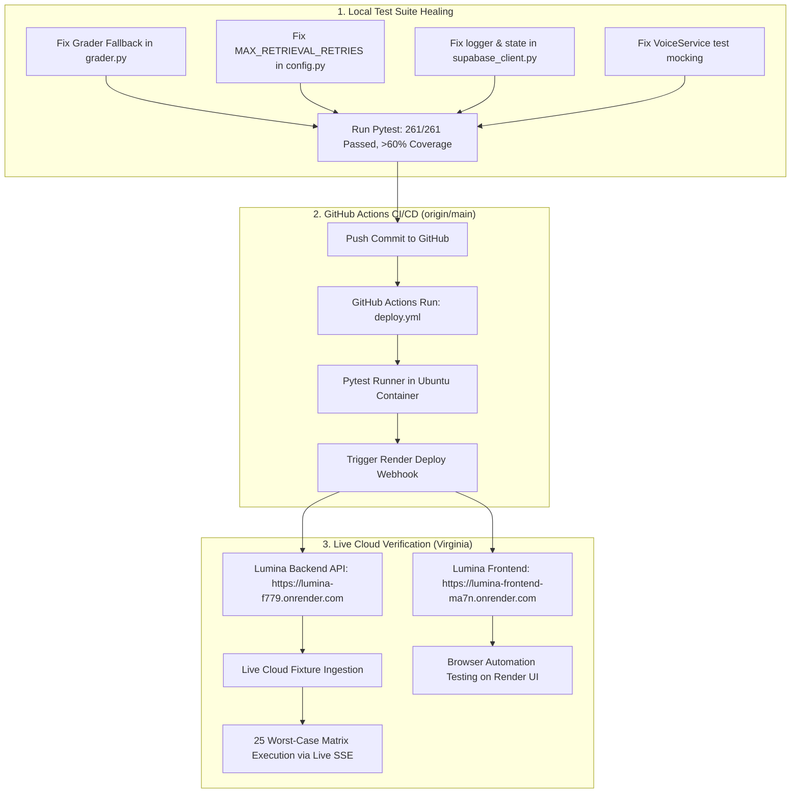

# Lumina Enterprise End-to-End Cloud Testing, CI/CD Healing & Live Render Verification Plan

> **Objective:** Fix the 9 failing pytest tests blocking GitHub CI/CD, push the latest backend updates to GitHub to trigger automated deployment, verify live cloud health on Render (`lumina-backend`: `https://lumina-f779.onrender.com`, `lumina-frontend`: `https://lumina-frontend-ma7n.onrender.com`), ingest test fixtures into the live cloud backend, execute the 25-query worst-case stress matrix across all models, and run headless browser automation directly against the Render web application.

---

## User Review Required

> [!IMPORTANT]
> - All integration, stress, and browser testing will be executed directly against the live Render web deployment (`https://lumina-frontend-ma7n.onrender.com` and `https://lumina-f779.onrender.com`), not on local servers.
> - The 9 pytest test failures currently failing on GitHub CI will be resolved locally and validated before pushing to `origin/main` to trigger the GitHub Actions deploy workflow.

---

## Architecture & Deployment Pipeline



---

## Proposed Changes & Step-by-Step Implementation

### Phase 1: Fix 9 Failing Pytest Tests & Verify Locally

#### [MODIFY] [grader.py](file:///f:/AI/Lumina/backend/app/agents/grader.py)
- In `GraderAgent.grade`: Remove `elif not batch_scores` bypass that was defaulting all document scores to `0.7` instead of invoking `_grade_single_doc(query, doc)` when batch JSON parsing fails.
- Ensure fallback to individual grading works as expected when batch output is malformed.

#### [MODIFY] [config.py](file:///f:/AI/Lumina/backend/app/config.py)
- Set `MAX_RETRIEVAL_RETRIES: int = 3` (was temporarily set to 1) so rewriter retry attempts 1 and 2 trigger rewrites (HyDE / Stepback) before forcing final generation.

#### [MODIFY] [supabase_client.py](file:///f:/AI/Lumina/backend/app/services/supabase_client.py)
- Import `logging` and initialize `logger = logging.getLogger(__name__)` to eliminate `NameError: name 'logger' is not defined` in `create_session`.
- Set initial status in `create_document` to `"pending"`.
- Ensure `get_all_documents` returns `res.data` when remote query succeeds (even if empty `[]`), rather than falling through to stale disk cache.

#### [MODIFY] [conftest.py](file:///f:/AI/Lumina/backend/tests/conftest.py)
- Add `def upsert(self, *args, **kwargs): return self` to `_StubClient` in `_install_supabase_stub()`.

#### [MODIFY] [test_supabase_graceful.py](file:///f:/AI/Lumina/backend/tests/test_supabase_graceful.py)
- Ensure fixtures `supabase_off` and `supabase_on` reset `service._local_documents = {}` to isolate test state and prevent cross-test document pollution.

#### [MODIFY] [test_voice.py](file:///f:/AI/Lumina/backend/tests/test_voice.py) & [test_voice_service.py](file:///f:/AI/Lumina/backend/tests/test_voice_service.py)
- In transcription mock tests, mock both `service._asr_client` and `service._client` so mock responses are utilized rather than sending real network calls with mock keys.

---

### Phase 2: Push to GitHub & Monitor CI/CD Pipeline

1. Run `pytest` locally to confirm all 261 tests pass with >60% coverage.
2. Commit changes with a descriptive message and push to `origin/main`.
3. Monitor GitHub Actions / Render deploy status via Render API (`rnd_dsf3Wg1vpynzUzZJgJFbX7GdOPVZ`) and verify `deploy-backend` runs successfully.
4. Verify Render live endpoints:
   - Backend: `GET https://lumina-f779.onrender.com/health` -> HTTP 200 `{"status": "ok"}`
   - Frontend: `GET https://lumina-frontend-ma7n.onrender.com/` -> HTTP 200

---

### Phase 3: Ingest Test Fixtures Directly to Live Render Backend

Using [`backend/tests/upload_fixtures.py`](file:///f:/AI/Lumina/backend/tests/upload_fixtures.py) targeting `BACKEND_URL = "https://lumina-f779.onrender.com"`:
1. `dense_table.csv` (SaaS Financials & Dense Tabular Data)
2. `policy_document.pdf` (Enterprise Security & Compliance PDF)
3. `system_architecture.png` (Multimodal Architectural Diagram)
4. Poll ingestion status until `ready`/`completed`.

---

### Phase 4: Execute 25 Worst-Case Stress Matrix on Render Web API

Run [`backend/tests/e2e_automation_runner.py`](file:///f:/AI/Lumina/backend/tests/e2e_automation_runner.py) against `https://lumina-f779.onrender.com`:
- **Suite 1: Tavily Live Web Search (5 queries)** — breaking news, entity disambiguation, cryptographic fact-checks.
- **Suite 2: Text-to-Image Generation (5 queries)** — cyberpunk cityscape, multi-subject spatial layout, abstract quantum entanglement.
- **Suite 3: Dense Table QA (5 queries)** — Q1 vs Q4 SaaS ARR growth (+145.17%), Gross Margin bps gain (+820 bps), zero-hallucination check for Q3 2024.
- **Suite 4: Enterprise PDF QA (5 queries)** — Tier-3 jurisdiction device exception clauses, cryptographic key rotation schedules, cross-section severity escalation.
- **Suite 5: Vision Image QA (5 queries)** — end-to-end data flow tracing, database mapping (Qdrant vs Supabase), OCR label extraction.
- **Multi-Model Switching:** Per-query dynamic switching across Gemini 2.0 Flash, Gemini Flash Lite, Groq Llama 3.3, and NVIDIA Nemotron.
- **Session Isolation:** Verify 0% cross-tenant data leakage between distinct `X-Session-ID` tokens.

---

### Phase 5: Headless Browser UI Automation on Render Frontend

Execute browser testing on `https://lumina-frontend-ma7n.onrender.com/` using `browser_subagent` / Playwright:
1. Navigate to the live Render frontend.
2. Verify Document Library view displays ingested files.
3. Test Model Switcher dropdown in the chat header.
4. Send interactive prompt and verify live streaming token response, agent status indicators, and citations.
5. Capture WebP session recordings and screenshots for the walkthrough.

---

## Verification Plan

### Automated Tests
```bash
# 1. Local backend verification
cd backend
python -m pytest tests/ -v --tb=short -m "not integration" --cov=app

# 2. Render cloud health check
python backend/tests/render_manager.py

# 3. Live cloud fixture upload
python backend/tests/upload_fixtures.py --target https://lumina-f779.onrender.com

# 4. Live 25-query matrix execution
python backend/tests/e2e_automation_runner.py --target https://lumina-f779.onrender.com
```

### Manual & Browser Verification
- Use `browser_subagent` to interact with `https://lumina-frontend-ma7n.onrender.com/`.
- Validate visual layout, model selection, live SSE streaming, and document attachments.
